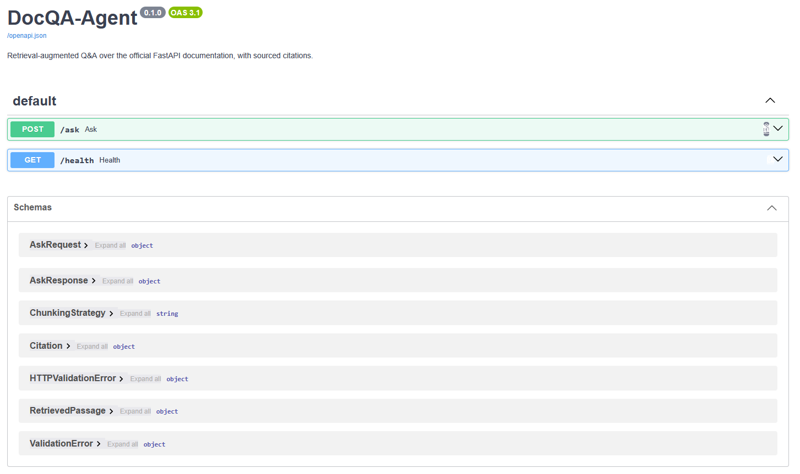
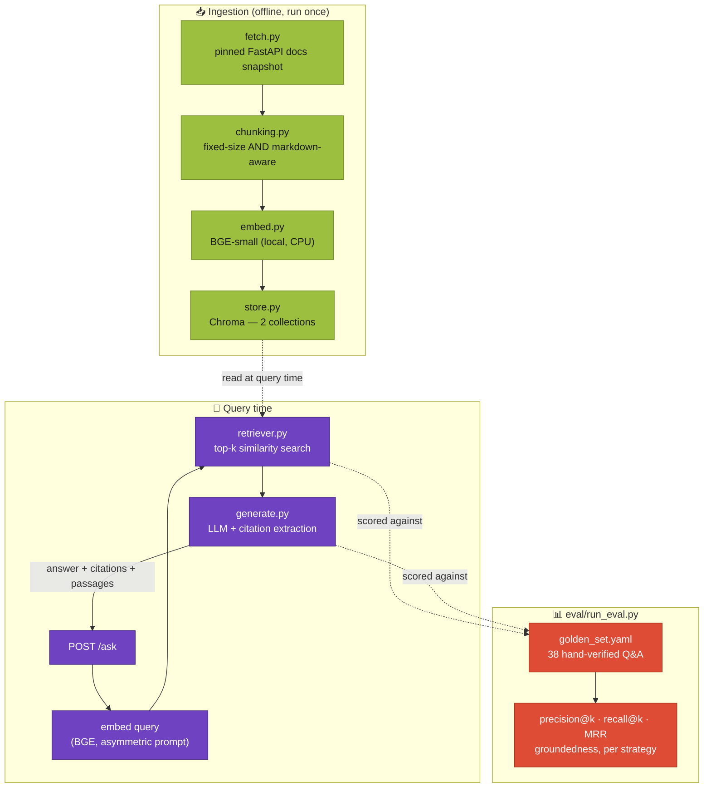

# DocQA-Agent

**A documentation Q&A assistant that shows its work — every claim traces back to a real passage, and every retrieval design decision is measured, not assumed.**

A demo project showing how retrieval-augmented generation (RAG) should be
built and *evaluated*, not just demoed: ask a question about FastAPI, get
an answer with inline citations to the exact file and section it came
from, and — the actual point of this repo — a real evaluation harness that
scores retrieval quality and answer groundedness against a hand-verified
question set, comparing two chunking strategies head to head with real
numbers instead of a gut feeling.

[](https://github.com/Totm33606/doc-qa-agent/actions/workflows/ci.yml)
[](https://www.python.org/)
[](LICENSE)
[](https://docs.astral.sh/uv/)
[](https://huggingface.co/BAAI/bge-small-en-v1.5)
[](https://www.trychroma.com/)
[](https://fastapi.tiangolo.com/)
[](https://docs.astral.sh/ruff/)
[](https://mypy-lang.org/)



*The interactive API docs FastAPI generates automatically at `/docs` — see [Example](#example) below for a real `/ask` request/response.*

---

## Table of contents

- [Why this project](#why-this-project)
- [Glossary](#glossary)
- [Architecture](#architecture)
- [Repository structure](#repository-structure)
- [Quickstart](#quickstart)
  - [Option A — uv (local dev)](#option-a--uv-local-dev)
  - [Option B — Docker](#option-b--docker)
- [Corpus](#corpus)
- [Ingestion & chunking](#ingestion--chunking)
- [Retrieval](#retrieval)
- [Generation & citations](#generation--citations)
- [Evaluation](#evaluation)
- [API](#api)
  - [Example](#example)
- [Testing & quality gates](#testing--quality-gates)
- [Technical choices & trade-offs](#technical-choices--trade-offs)
- [Out of scope](#out-of-scope)
- [License](#license)

---

## Why this project

Companion to [finrisk-agent](https://github.com/Totm33606/finrisk-agent) —
that project demonstrates tool-calling agents and a classic ML pipeline;
this one demonstrates semantic retrieval and grounded generation, the
other half of what "AI over your own data" actually requires. The two
deliberately don't overlap:

- **The corpus is real, not synthetic, and pinned.** This project answers
  questions from the actual official FastAPI documentation — fetched once
  from a specific, recorded release tag (see [Corpus](#corpus)), not
  scraped live on every run and not invented. That's what makes it
  possible to write golden questions with answers you can check by hand.
- **Two chunking strategies are built and measured, not just one picked
  by instinct.** Fixed-size chunking and a header-aware chunker that
  respects document structure are both implemented, and
  [Evaluation](#evaluation) reports real precision/recall/groundedness
  numbers for both — the comparison itself is a deliverable, not an
  implementation detail hidden in a config file.
- **Every claim in a generated answer is checkable.** The prompt requires
  a `[source: N]` citation after every factual statement; the citation is
  resolved back to the exact retrieved passage in code (not trusted at
  face value), and an answer's groundedness score is computed from that,
  not asserted by the model itself.
- **No paid API key required to run any of it end to end.** Embeddings run
  locally (`BAAI/bge-small-en-v1.5`, CPU, ~130MB), the vector store is
  embedded (Chroma, no server to run), and generation defaults to a local
  Ollama model — see [Quickstart](#quickstart).

## Glossary

Quick definitions for terms used throughout this README — skip if you're
already familiar with them.

**Retrieval**
- **RAG (Retrieval-Augmented Generation)**: instead of an LLM answering
  from what it memorized during training, you first *retrieve* relevant
  text from a known source, then ask the LLM to answer *using only that
  text* — the point is a grounded, checkable answer instead of a guess.
- **Embedding**: a piece of text converted into a list of numbers (a
  vector) such that texts with similar meaning end up as nearby vectors.
  Search then becomes "find the nearest vectors" instead of keyword
  matching.
- **Chunk**: a corpus is too big to embed as one block, so it's split into
  smaller pieces ("chunks") first — each chunk gets its own embedding and
  is retrieved independently. How you split matters a lot; see
  [Ingestion & chunking](#ingestion--chunking).
- **Vector store**: a database specialized for "find the K nearest
  vectors to this one" instead of exact-match lookups. Chroma here.
- **top-k**: how many chunks the retriever returns for a given question
  (this project defaults to 5).
- **precision@k / recall@k**: of the *k* passages retrieved, what
  fraction were actually relevant (precision), and of all the passages
  that *should* have been retrieved, what fraction did the search
  actually find (recall)? See [Evaluation](#evaluation).
- **MRR (Mean Reciprocal Rank)**: rewards finding the right passage
  *early* — 1st place scores 1.0, 2nd place scores 0.5, 3rd scores 0.33,
  etc., averaged across all questions.

**Generation**
- **LLM**: a large language model (e.g. a GPT/Llama/Qwen-family model) —
  the "writer" that turns retrieved passages into a natural-language
  answer.
- **Grounding / hallucination**: an answer is "grounded" when every claim
  in it is actually backed by the retrieved text; a "hallucination" is a
  claim the model invented that isn't backed by anything it was shown.
  This project's `groundedness_score` (see [Evaluation](#evaluation)) is
  an automated, syntactic proxy for the first, catching a specific case
  of the second: a citation to a passage that was never actually
  retrieved.
- **Citation**: here, a `[source: N]` marker in the answer pointing back
  to one of the numbered passages shown to the model — resolved to the
  passage's file and section in code, not just trusted as text the model
  wrote.

## Architecture



Three stages, each independently testable and independently swappable.
**Why split it this way:**

- **Ingestion is offline and idempotent.** Fetching, chunking and
  embedding the corpus is a batch job (`ingestion.build`), not something
  that happens on the request path — a query never waits on a network
  call to GitHub or re-chunks anything. Query time only ever *reads* the
  already-built Chroma collections.
- **Both chunking strategies are built as first-class collections, not a
  toggle that overwrites the other.** `fastapi_docs_fixed` and
  `fastapi_docs_markdown` are two separate, simultaneously-queryable
  Chroma collections — `/ask` picks one per request (`strategy` field),
  and `eval.run_eval` scores both from the same golden set in one run.
- **Generation never trusts its own citations.** `generate.py` extracts
  every `[source: N]` marker with a regex and resolves `N` against the
  actual list of retrieved passages in Python — a citation to an index
  that was never shown is caught mechanically, not by asking the model to
  grade itself.

## Repository structure

```
doc-qa-agent/
├── pyproject.toml              # single source of truth for deps (uv-managed)
├── Makefile                    # make fetch / build / eval / api / test
├── src/
│   ├── common/schemas.py       # shared data models (ingestion ↔ retrieval ↔ generation ↔ API)
│   ├── ingestion/
│   │   ├── config.py           # typed, env-overridable settings
│   │   ├── fetch.py            # pinned corpus fetch + Markdown cleanup
│   │   ├── chunking.py         # fixed-size AND markdown-aware chunkers
│   │   ├── embed.py            # BGE-small wrapper (asymmetric query/doc embedding)
│   │   ├── store.py            # Chroma collection wrapper
│   │   └── build.py            # orchestrates fetch → chunk → embed → store
│   ├── retrieval/retriever.py  # query embedding → top-k similarity search
│   ├── generation/
│   │   ├── llm.py              # chat model construction (local-first, mirrors finrisk-agent)
│   │   ├── prompt.py           # the grounding contract shown to the LLM
│   │   └── generate.py         # citation extraction + groundedness scoring
│   └── api/app.py              # FastAPI app: POST /ask, GET /health
├── data/
│   ├── raw/                    # the pinned corpus — committed (small, text-only, reproducible)
│   └── chroma/                 # the vector store — gitignored, rebuilt via `ingestion.build`
├── eval/
│   ├── golden_set.yaml         # 38 hand-verified Q&A pairs against the real corpus
│   └── run_eval.py             # precision@k / recall@k / MRR / groundedness, per strategy
├── tests/                      # pytest: hermetic (fake embedder/LLM), + 1 real-model integration file
├── docker/Dockerfile           # bakes the corpus + vector store in at build time (see below)
└── .github/workflows/ci.yml    # lint, typecheck, build the store, test — on every push
```

## Quickstart

### Option A — uv (local dev)

```bash
git clone https://github.com/<you>/doc-qa-agent.git
cd doc-qa-agent
cp .env.example .env          # optional — defaults already work with local Ollama

uv venv
uv pip install -e ".[dev]"

# The corpus (data/raw/) is already committed, so this step is only needed
# to refresh it against a newer FastAPI release:
#   uv run python -m ingestion.fetch

uv run python -m ingestion.build      # chunk + embed + store both strategies (~2 min on CPU)
uv run python -m eval.run_eval        # precision/recall/MRR + groundedness, both strategies

uv run uvicorn api.app:app --reload --port 8000
curl -X POST localhost:8000/ask -H "Content-Type: application/json" \
  -d '{"question": "How do I add validation to a query parameter?"}'
```

Generation defaults to a **local Ollama model** — no API key needed, but
Ollama itself must be running with a tool-capable-or-not instruct model
pulled (e.g. `ollama pull qwen2.5:7b-instruct`; any reasonable
instruction-following model works, tool calling isn't required here). No
Ollama running and no cloud key configured means `/ask` returns a 502 on
the generation step — retrieval and evaluation's retrieval metrics work
regardless, since only `eval.run_eval`'s generation half and `/ask` need
an LLM. See [.env.example](.env.example) for the Azure OpenAI / OpenAI
fallback options.

On Linux/macOS/WSL, [Makefile](Makefile) wraps the same commands under
shorter names (`make build`, `make eval`, `make api`, `make test`) — CI
itself calls `uv` directly (see [ci.yml](.github/workflows/ci.yml)), so
`uv` is what's guaranteed to work everywhere, including native Windows
where `make` isn't available out of the box.

### Option B — Docker

```bash
docker build -f docker/Dockerfile -t doc-qa-agent .
docker run -p 8000:8000 \
  -e LOCAL_LLM_BASE_URL=http://host.docker.internal:11434/v1 \
  doc-qa-agent
```

The image builds the corpus into both Chroma collections **at image-build
time** (`RUN python -m ingestion.build` in [docker/Dockerfile](docker/Dockerfile)),
so the container starts instantly and never needs network access at
runtime except to reach whichever LLM `/ask` is configured to call —
`host.docker.internal` is how the container reaches Ollama running on the
host machine; point it at Azure/OpenAI instead via the same env vars as
[.env.example](.env.example) if you'd rather not run Ollama at all.

## Corpus

Real, not synthetic — but scoped and pinned, not the whole live site.
`ingestion/fetch.py` downloads **67 Markdown pages** (the core tutorial +
a curated set of advanced-guide pages — path params through SQL
databases, dependencies, security, testing, background tasks, events,
sub-applications, etc.) directly from the `fastapi/fastapi` GitHub
repository's actual documentation *source* files, at the pinned release
tag `0.141.1` (recorded in `data/raw/manifest.json` alongside the fetch
timestamp) — not the rendered HTML site, and not a live, unpinned fetch on
every run.

**Why a single, well-documented project instead of a general corpus:** a
deliberately narrow scope is what makes it possible to write
[golden_set.yaml](eval/golden_set.yaml)'s 38 questions with answers a
human can actually verify against a fixed, known text — try that against
"the whole internet" and every claim becomes unfalsifiable. **Why pin a
specific tag instead of always fetching latest:** a golden question's
`expected_sources` names exact files and relies on their content staying
put; floating against `main` would make this eval suite non-reproducible
the moment FastAPI's docs change.

Deliberately excluded: `reference/` (auto-generated API-signature stubs,
near-zero prose to retrieve against), `deployment/`, `about/`,
`alternatives.md`, `benchmarks.md`, `history-design-future.md`,
`contributing.md`, `translations.md` — meta/marketing pages, not the kind
of "how do I do X" content this project is built to answer questions
about. See the `TUTORIAL_PAGES` / `ADVANCED_PAGES` lists in
[fetch.py](src/ingestion/fetch.py) for the exact set.

**Markdown preprocessing** (also in `fetch.py`, since the raw doc source
uses syntax a plain Markdown reader doesn't understand):
- FastAPI's own docs-build macro, `{* path/to/file.py hl[6:7] *}` (a
  reference to a source-code example file, with an optional line range and
  highlight spec), is resolved by actually fetching that file and inlining
  it as a real fenced code block — without this, close to a third of a
  typical tutorial page renders as a blank line where the code example
  should be.
- `///tip ... ///` / `///note ... ///` admonition blocks (a
  mkdocs-material extension) are flattened into blockquotes.
- The `<div class="termy">...</div>` animated-terminal wrapper is
  stripped, keeping the plain console code block inside.
- `{ #anchor-id }` header-ID annotations are stripped from headings.

## Ingestion & chunking

Two chunking strategies are built into two separate Chroma collections —
this comparison is the point of the project, not a config flag buried
somewhere:

| | **Fixed-size** (`fastapi_docs_fixed`) | **Markdown-aware** (`fastapi_docs_markdown`) |
|---|---|---|
| How it splits | A paragraph → line → sentence → word → char separator hierarchy (`RecursiveCharacterTextSplitter`, from `langchain-text-splitters`), sized in real tokens via `tiktoken` — blind to document structure | Split by Markdown header first (own hand-rolled splitter — see below), *then* only run the same recursive splitter on a section that's still over budget |
| Chunk size / overlap | ~500 tokens / 50 tokens overlap, same budget for both | same |
| Citable unit | No section info (`"(no section — fixed-size chunking)"`) | A header breadcrumb, e.g. `"Path Parameters > Order matters"` |
| Chunks produced (this corpus) | **347** | **693** |
| Mean tokens/chunk | 428 | 205 |

**Why not LangChain's own `MarkdownHeaderTextSplitter` for the
header-aware side:** it round-trips content through the `markdown` HTML
library to find headers, which silently collapses code-block indentation
(`    return {"item_id": item_id}` becomes `return {"item_id": item_id}`)
— corrupting the Python example in nearly every chunk of a docs corpus
that's mostly Python examples. `ingestion/chunking.py::_split_by_headers`
is a ~40-line, fence-aware line scanner instead: it tracks whether it's
inside a ` ``` ` code block and never rewrites a line's content, only
decides where section boundaries fall.

```bash
uv run python -m ingestion.build   # rebuilds both collections from data/raw/
```

## Retrieval

`retrieval/retriever.py` embeds the question and does a cosine-similarity
top-k search against one strategy's Chroma collection —
`Retriever(embedder, strategy, store=...)`, injectable for testing.

**Asymmetric query/document embedding**: `BAAI/bge-small-en-v1.5`'s model
card recommends prefixing the *query* only (never the stored passages)
with an instruction (`"Represent this sentence for searching relevant
passages: "`) for retrieval tasks — it's what the model was fine-tuned to
expect. `ingestion/embed.py::BGEEmbedder` applies this asymmetry
explicitly (`embed_query` vs `embed_documents`), which is also exactly why
`store.py` computes embeddings itself and passes them to Chroma, instead
of handing Chroma an embedding function it would apply identically to
both queries and documents.

## Generation & citations

`generation/prompt.py` shows the LLM a numbered list of retrieved
passages (`[1] tutorial/path-params.md#Path Parameters > Order
matters\n<passage text>`, `[2] ...`) and instructs it to cite every claim
as `[source: N]`, where `N` is the passage number — **by index, not by
copying the file/section string verbatim.**

That's a deliberate revision, not the first design: an earlier version
asked the model to reproduce the `source_file#section` string
character-for-character, so the citation could be checked by simple
string equality. In practice, the local 7B model this project defaults to
reliably mangled a long string with backticks and `>` breadcrumbs in it
(dropping a segment, swapping `>` for `#`) — which silently zeroed out
the groundedness score for answers that were, in substance, correctly
sourced. A single digit copied from `[N]` right above the passage it
refers to is something even a small local model reproduces reliably; the
index is resolved back to the exact `(source_file, section)` in
`generate.py::extract_citations`, so there's no loss of precision, only a
far more robust format for a small model to actually produce.

`generation/llm.py::build_llm` mirrors `agent/agent.py::_build_llm` in the
finrisk-agent sibling project (Azure OpenAI > local server > plain
OpenAI), with one deliberate difference: **the local server is the
default here, not opt-in** — finrisk-agent's brief allowed OpenAI as the
ultimate fallback, this project's brief calls for a free local LLM as the
actual default, so cloning the repo and running the demo never implies an
API cost.

## Evaluation

**The most important deliverable in this repo.** 38 questions in
[eval/golden_set.yaml](eval/golden_set.yaml) were written by hand against
the actual fetched corpus (not from memory) — every `expected_sources`
entry is a real file in `data/raw/`, checked programmatically to exist.
`eval/run_eval.py` scores both chunking strategies against this set in one
run:

Numbers below are from an actual run of `uv run python -m eval.run_eval`
on this repository (38 questions, k=5, `qwen2.5:7b-instruct` via Ollama
for generation) — not rounded to look better:

| Metric | Fixed-size | Markdown-aware |
|---|---|---|
| Precision@5 | 0.5632 | **0.5789** |
| Recall@5 | **0.9737** | 0.9342 |
| MRR | **0.9079** | 0.8662 |
| Mean groundedness | 0.7234 | **0.7303** |

**In plain terms:** both strategies find *a* correct source for nearly
every question (recall is high for both) — the real difference is
*ranking*. Fixed-size chunking's MRR of 0.91 vs markdown-aware's 0.87
means fixed-size tends to put the right passage closer to position 1;
markdown-aware wins narrowly on precision@5 (marginally fewer irrelevant
passages in the top 5) and on groundedness. **Neither strategy is
strictly better here** — the honest reading is that at this corpus size
(347 vs 693 chunks) and this k, the two are close, with fixed-size having
a slight edge on ranking quality and markdown-aware a slight edge on
precision and downstream answer grounding. This is a smaller, noisier gap
than the "markdown-aware should obviously win" intuition might predict,
which is exactly why measuring it beats assuming it.

**How `precision@k` / `recall@k` / `MRR` are computed**
(`eval/run_eval.py::evaluate_retrieval`): a question's "correct" sources
are the file(s) in its `expected_sources`. `precision@k` = (retrieved
passages whose file is in `expected_sources`) / k. `recall@k` = (expected
files that appear anywhere in the top-k) / (total expected files). `MRR`
= 1/rank of the first retrieved passage from an expected file, averaged
over all questions. Ground truth is at the **file** level, not the
chunk/section level — the two strategies don't share chunk boundaries, so
file-level agreement is the fair common ground for comparing them.

**How `groundedness` is computed**
(`generation/generate.py::compute_groundedness`): the answer is split at
each `[source: N]` marker; the text before a marker is one "claim
segment", counted as grounded only if `N` is a valid index into the
passages actually retrieved. This is a **syntactic proxy**, not a
semantic entailment check — it catches "the model cited nothing" and "the
model cited something it wasn't shown" (real hallucination signals), but
it does *not* verify that the cited passage actually *says* what the
claim asserts, and it can't detect a claim smuggled into the middle of a
multi-sentence segment that only gets a citation at the very end (that
whole segment is scored as one unit). A cheaper, real limitation worth
being upfront about, in the spirit of not rounding the numbers above to
look flattering either.

```bash
uv run python -m eval.run_eval                    # full report: retrieval + generation
uv run python -m eval.run_eval --skip-generation   # retrieval only, no LLM required (what CI runs)
```

## API

```bash
uv run uvicorn api.app:app --reload --port 8000
```

| Endpoint | Purpose |
|---|---|
| `POST /ask` | `{"question": str, "top_k": int = 5, "strategy": "fixed" \| "markdown" = "markdown"}` → `{answer, citations, passages, groundedness_score}` |
| `GET /health` | Liveness check |

No frontend — the effort here is retrieval/generation/evaluation, not a
second UI on top of what finrisk-agent's dashboard already demonstrates.

### Example

A real, unedited response from this repository (`qwen2.5:7b-instruct` via
Ollama, `strategy=markdown`, `top_k=5` — `passages` trimmed to one entry
below for readability; the real response returns all 5):

```bash
curl -X POST localhost:8000/ask -H "Content-Type: application/json" \
  -d '{"question": "Why does the order of path operations matter in FastAPI?"}'
```

```json
{
  "question": "Why does the order of path operations matter in FastAPI?",
  "answer": "The order of path operations matters in FastAPI because path operations are evaluated in the order they are declared. If the paths are not ordered correctly, a more specific path might match a request intended for a more general path. For example, if `/users/me` is declared after `/users/{user_id}`, the latter would match `/users/me`, treating \"me\" as a parameter, instead of recognizing it as a specific path.\n\n[source: 1]",
  "citations": [
    {
      "source_file": "tutorial/path-params.md",
      "section": "Path Parameters > Order matters",
      "matched_passage": true
    }
  ],
  "passages": [
    {
      "chunk_id": "markdown:tutorial/path-params.md:7",
      "text": "## Order matters\n\nWhen creating *path operations*, you can find situations where you have a fixed path...",
      "source_file": "tutorial/path-params.md",
      "section": "Path Parameters > Order matters",
      "score": 0.8416570425033569
    }
  ],
  "groundedness_score": 1.0
}
```

Every claim in `answer` is followed by a `[source: N]` marker; `citations`
resolves each one back to the exact file and section it came from, and
`groundedness_score` is computed from that resolution (see
[Evaluation](#evaluation)) — not asserted by the model.

## Testing & quality gates

```bash
uv run pytest          # 57 tests, hermetic except one file (see below)
uv run ruff check src tests eval
uv run ruff format --check src tests eval
uv run mypy src eval
```

**Hermetic by design**: every test except `tests/test_integration.py`
uses `FakeEmbedder` (deterministic, hash-based) and `FakeChatModel`
(canned response) instead of the real BGE model or a real LLM — no
network, no Ollama, no API key needed to run the suite, and it runs in
seconds. `test_integration.py` is the one place the real
`BAAI/bge-small-en-v1.5` model gets exercised (marked `integration`, still
run by CI by default — downloading a free, ~130MB local model isn't the
kind of external-service dependency the rest of the suite avoids); one
test in that file additionally checks the real, already-built
`data/chroma` store and is skipped gracefully if it hasn't been built yet.

CI (`.github/workflows/ci.yml`) lints, type-checks, **builds the real
vector store** (`ingestion.build`, so the integration test has something
real to query), then runs the full suite with coverage — on every push
and PR, mirroring finrisk-agent's own quality bar exactly.

## Technical choices & trade-offs

### Stack justification

| Layer | Choice | Why |
|---|---|---|
| Embeddings | `BAAI/bge-small-en-v1.5` (local, CPU, `sentence-transformers`) | A strong small (384-dim, ~130MB) retrieval-tuned model — no API key, no GPU required, runs the whole corpus in under a minute on CPU. Its asymmetric query-instruction convention is applied explicitly (see [Retrieval](#retrieval)) rather than ignored, which is where most of its retrieval quality actually comes from. |
| Vector store | Chroma, embedded (no server) | Zero infra to stand up — consistent with the "clone and run in a few minutes" bar already set by finrisk-agent. `PersistentClient` for the real corpus, `EphemeralClient` (in-memory) for every test, at zero extra code. |
| Chunking (fixed) | `RecursiveCharacterTextSplitter` (`langchain-text-splitters`), sized via `tiktoken` | The de facto standard "MVP" chunker; using the actual named class rather than a hand-rolled equivalent is exactly what the "RecursiveCharacterTextSplitter-equivalent" brief calls for. Token-based (not character-based) sizing means "~500 tokens" means what it says regardless of how dense the prose is. |
| Chunking (markdown) | Hand-rolled fence-aware header splitter | LangChain's own `MarkdownHeaderTextSplitter` corrupts code-block indentation by round-tripping through the `markdown` HTML library — see [Ingestion & chunking](#ingestion--chunking) for the concrete before/after. A ~40-line line scanner that tracks fence state avoids the bug entirely and is easier to reason about than fighting a general-purpose Markdown parser into not doing that. |
| Generation LLM | Ollama (local, default) → Azure OpenAI → OpenAI | Mirrors `agent/agent.py::_build_llm` in finrisk-agent for stack consistency between the two portfolio projects, with the priority order reversed at the top so a local model is the actual default here (see [Generation & citations](#generation--citations)) rather than an opt-in. |
| Citation format | Passage index (`[source: N]`), not verbatim file/section string | A small local LLM reliably reproduces a single digit; it does *not* reliably reproduce a long string with backticks and `>` breadcrumbs verbatim. Switching formats measurably fixed real, observed groundedness scores that were wrong for the right reason (see [Generation & citations](#generation--citations)) — this is documented as a design decision that changed after being run against a real small model, not a hypothetical. |
| Corpus fetch | GitHub raw Markdown *source*, pinned tag | The actual docs-source files, not scraped rendered HTML — cleaner to parse, and pinning a tag (recorded in `data/raw/manifest.json`) is what keeps `golden_set.yaml`'s hand-written `expected_sources` valid indefinitely instead of drifting the moment the live site changes. |
| Configuration | pydantic-settings | One typed, validated settings object (`ingestion/config.py`) shared by fetch/build/retrieval/eval, so they can't silently drift out of sync — same rationale as `ml_pipeline/config.py` in finrisk-agent. |
| API | FastAPI | The framework this whole corpus documents, and a natural fit for a small, typed, single-endpoint service — `Retriever`/embedder are built once in `lifespan`, not per-request. |
| Packaging & running | uv | Same reasoning as finrisk-agent: one fast tool for environments, installs and running scripts, working identically on Windows/macOS/Linux. |

### Design decisions & trade-offs

- **The corpus is committed; the vector store is not.** `data/raw/` is
  ~752KB of plain Markdown — small enough to commit outright, and doing so
  is what makes the golden set's file references and the whole eval suite
  reproducible without depending on GitHub being reachable. `data/chroma/`
  is a ~16MB derived binary artifact (like `models/` in finrisk-agent) —
  gitignored, rebuilt in seconds via `ingestion.build`.
- **Groundedness is a proxy, not a semantic check, and the README says so
  in the numbers' own section** (see [Evaluation](#evaluation)) rather
  than only in code comments — a metric whose limitations aren't stated
  next to its headline number is easy to over-trust.
- **Both strategies are scored by the exact same pipeline, retrievers and
  Chroma access pattern** (`eval/run_eval.py::evaluate_retrieval` /
  `evaluate_generation` loop over `ChunkingStrategy` and reuse the same
  code path for both) — the only thing that differs between the two rows
  in the [Evaluation](#evaluation) table is which collection got built,
  never how it's queried or scored.
- **File-level, not chunk-level, retrieval ground truth.** The two
  chunking strategies produce different chunk boundaries for the same
  underlying text, so scoring "did the exact expected chunk come back" is
  meaningless across strategies — file-level agreement is the fair common
  denominator (see [Evaluation](#evaluation)).

## Out of scope

Explicitly, to keep this project's effort where the brief asked for it:
no frontend/UI, no reranking, no hybrid BM25+vector search, no
authentication or multi-user support, no deployment infrastructure beyond
what running the demo locally needs. All plausible follow-ups, none of
them required to demonstrate retrieval + grounding + evaluation, which is
what this repository is actually for.

## License

MIT — see [LICENSE](LICENSE).
