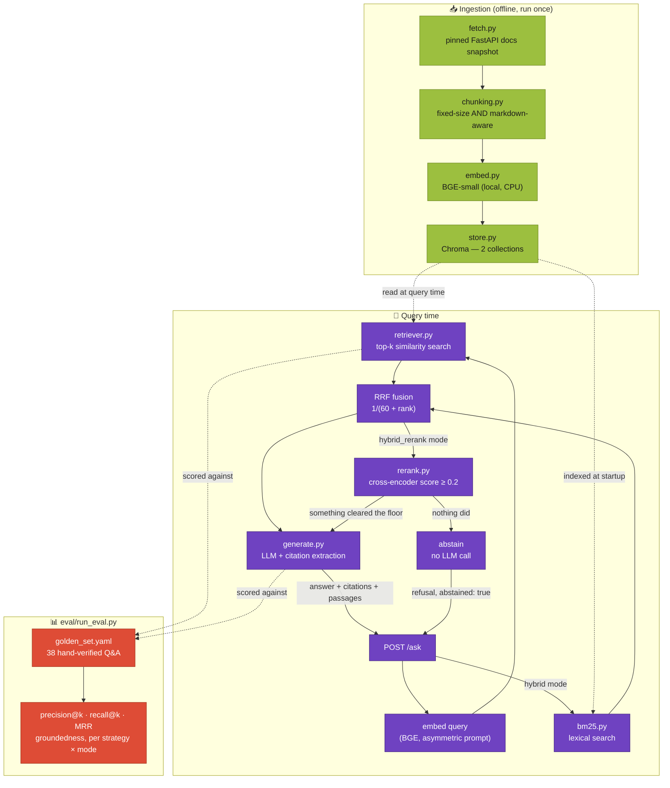

# DocQA-Agent

**A documentation Q&A assistant that shows its work — every claim traces back to a real passage, and every retrieval design decision is measured, not assumed.**

A demo project showing how retrieval-augmented generation (RAG) should be
built and *evaluated*, not just demoed: ask a question about FastAPI, get
an answer with inline citations to the exact file and section it came
from, and — the actual point of this repo — a real evaluation harness that
scores retrieval quality and answer groundedness against a hand-verified
question set, comparing two chunking strategies and two retrieval modes
(dense, and hybrid BM25 + RRF) head to head with real numbers instead of a
gut feeling.

[](https://github.com/Totm33606/doc-qa-agent/actions/workflows/ci.yml)
[](https://www.python.org/)
[](LICENSE)
[](https://docs.astral.sh/uv/)
[](https://huggingface.co/BAAI/bge-small-en-v1.5)
[](https://www.trychroma.com/)
[](#retrieval)
[](https://fastapi.tiangolo.com/)
[](https://docs.astral.sh/ruff/)
[](https://mypy-lang.org/)


*The interactive API docs FastAPI generates automatically at `/docs` — see [Example](#example) below for a real `/ask` request/response.*

---

## Table of contents

- [Why this project](#why-this-project)
- [Glossary](#glossary)
- [Architecture](#architecture)
- [Repository structure](#repository-structure)
- [Quickstart](#quickstart)
  - [Option A — uv (local dev)](#option-a--uv-local-dev)
  - [Option B — Docker](#option-b--docker)
- [Corpus](#corpus)
- [Ingestion & chunking](#ingestion--chunking)
- [Retrieval](#retrieval)
  - [Asymmetric query/document embedding](#asymmetric-querydocument-embedding)
  - [Hybrid search: BM25 + embeddings, fused by rank](#hybrid-search-bm25--embeddings-fused-by-rank)
  - [Cross-encoder re-ranking, and the thing fusion structurally cannot do](#cross-encoder-re-ranking-and-the-thing-fusion-structurally-cannot-do)
  - [When nothing is relevant enough](#when-nothing-is-relevant-enough)
- [Generation & citations](#generation--citations)
  - [Refusing to answer](#refusing-to-answer)
- [Evaluation](#evaluation)
  - [Knowing what it doesn't know](#knowing-what-it-doesnt-know)
- [API](#api)
  - [Example](#example)
- [Testing & quality gates](#testing--quality-gates)
- [Technical choices & trade-offs](#technical-choices--trade-offs)
- [Out of scope](#out-of-scope)
- [License](#license)

---

## Why this project

Companion to [finrisk-agent](https://github.com/Totm33606/finrisk-agent) —
that project demonstrates tool-calling agents and a classic ML pipeline;
this one demonstrates semantic retrieval and grounded generation, the
other half of what "AI over your own data" actually requires. The two
deliberately don't overlap:

- **The corpus is real, not synthetic, and pinned.** This project answers
  questions from the actual official FastAPI documentation — fetched once
  from a specific, recorded release tag (see [Corpus](#corpus)), not
  scraped live on every run and not invented. That's what makes it
  possible to write golden questions with answers you can check by hand.
- **Two chunking strategies are built and measured, not just one picked
  by instinct.** Fixed-size chunking and a header-aware chunker that
  respects document structure are both implemented, and
  [Evaluation](#evaluation) reports real precision/recall/groundedness
  numbers for both — the comparison itself is a deliverable, not an
  implementation detail hidden in a config file.
- **Every claim in a generated answer is checkable.** The prompt requires
  a `[source: N]` citation after every factual statement; the citation is
  resolved back to the exact retrieved passage in code (not trusted at
  face value), and an answer's groundedness score is computed from that,
  not asserted by the model itself.
- **It can say "I don't know", and that's measured too.** Retrieval always
  produces a ranking; whether anything *in* that ranking is relevant is a
  separate question, and one a rank-fusion score structurally cannot answer.
  A cross-encoder re-ranking stage gives a score that can, and a floor
  measured against 10 questions the corpus cannot answer decides where to
  put it — see [When nothing is relevant enough](#when-nothing-is-relevant-enough).
- **No paid API key required to run any of it end to end.** Embeddings and
  re-ranking run locally (`BAAI/bge-small-en-v1.5` and
  `cross-encoder/ms-marco-MiniLM-L-6-v2`, CPU, ~130MB and ~90MB), the vector
  store is embedded (Chroma, no server to run), and generation defaults to a
  local Ollama model — see [Quickstart](#quickstart).

## Glossary

Quick definitions for terms used throughout this README — skip if you're
already familiar with them.

**Retrieval**
- **RAG (Retrieval-Augmented Generation)**: instead of an LLM answering
  from what it memorized during training, you first *retrieve* relevant
  text from a known source, then ask the LLM to answer *using only that
  text* — the point is a grounded, checkable answer instead of a guess.
- **Embedding**: a piece of text converted into a list of numbers (a
  vector) such that texts with similar meaning end up as nearby vectors.
  Search then becomes "find the nearest vectors" instead of keyword
  matching.
- **Chunk**: a corpus is too big to embed as one block, so it's split into
  smaller pieces ("chunks") first — each chunk gets its own embedding and
  is retrieved independently. How you split matters a lot; see
  [Ingestion & chunking](#ingestion--chunking).
- **Vector store**: a database specialized for "find the K nearest
  vectors to this one" instead of exact-match lookups. Chroma here.
- **top-k**: how many chunks the retriever returns for a given question
  (this project defaults to 5).
- **BM25**: the classic *lexical* ranking function — it scores a passage by
  how often the query's words appear in it, weighted by how rare each word
  is across the corpus. No embeddings, no notion of meaning: it matches the
  literal token, which is exactly what an embedding tends to blur
  (`response_model_exclude_unset` is a *word* to BM25, a vague direction in
  space to an embedder).
- **Hybrid search**: running both searches — embedding *and* BM25 — and
  combining their results, on the theory that they fail on different
  questions.
- **RRF (Reciprocal Rank Fusion)**: how the two are combined here. Each
  retriever's *ranking* is kept and its scores thrown away: a passage gets
  `1/(60 + its rank)` from each list it appears in, and those add up. See
  [Retrieval](#retrieval) for why rank rather than score.
- **precision@k / recall@k**: of the *k* passages retrieved, what
  fraction were actually relevant (precision), and of all the passages
  that *should* have been retrieved, what fraction did the search
  actually find (recall)? See [Evaluation](#evaluation).
- **MRR (Mean Reciprocal Rank)**: rewards finding the right passage
  *early* — 1st place scores 1.0, 2nd place scores 0.5, 3rd scores 0.33,
  etc., averaged across all questions.
- **Cross-encoder / re-ranker**: a model that reads the question and one
  passage *together* and scores how well that passage answers it. More
  accurate than an embedding comparison (which encodes each side
  separately and never sees them together), and far slower — so it runs
  over the ~20 candidates cheap retrieval already found, not the whole
  corpus. See [Retrieval](#retrieval).
- **Abstention**: declining to answer because nothing retrieved was
  relevant enough. Needs a score that means the same thing from one
  question to the next, which is what a cross-encoder provides and a
  rank-based score like RRF cannot — see
  [When nothing is relevant enough](#when-nothing-is-relevant-enough).

**Generation**
- **LLM**: a large language model (e.g. a GPT/Llama/Qwen-family model) —
  the "writer" that turns retrieved passages into a natural-language
  answer.
- **Grounding / hallucination**: an answer is "grounded" when every claim
  in it is actually backed by the retrieved text; a "hallucination" is a
  claim the model invented that isn't backed by anything it was shown.
  This project's `groundedness_score` (see [Evaluation](#evaluation)) is
  an automated, syntactic proxy for the first, catching a specific case
  of the second: a citation to a passage that was never actually
  retrieved.
- **Citation**: here, a `[source: N]` marker in the answer pointing back
  to one of the numbered passages shown to the model — resolved to the
  passage's file and section in code, not just trusted as text the model
  wrote.

## Architecture



Three stages, each independently testable and independently swappable.
**Why split it this way:**

- **Ingestion is offline and idempotent.** Fetching, chunking and
  embedding the corpus is a batch job (`ingestion.build`), not something
  that happens on the request path — a query never waits on a network
  call to GitHub or re-chunks anything. Query time only ever *reads* the
  already-built Chroma collections.
- **Both chunking strategies are built as first-class collections, not a
  toggle that overwrites the other.** `fastapi_docs_fixed` and
  `fastapi_docs_markdown` are two separate, simultaneously-queryable
  Chroma collections — `/ask` picks one per request (`strategy` field),
  and `eval.run_eval` scores both from the same golden set in one run.
- **Retrieval mode is a dimension of the eval, not a switch someone flipped
  once.** `dense`, `hybrid` (BM25 + RRF) and `hybrid_rerank` (+ cross-encoder)
  are all first-class at query time, and `eval.run_eval` scores every
  strategy × mode pair in one run — six rows, from the same golden set.
  That's what turned "hybrid search should help" into the far more specific
  finding in [Evaluation](#evaluation): it helps one chunking strategy and
  does nothing for the other. The same harness is what makes re-ranking's
  own trade-off measurable rather than assumed.
- **Refusing to answer is a retrieval decision, made in code.** Fusion can
  rank candidates against each other but not judge whether the best of them
  is any good, so `hybrid_rerank` adds a cross-encoder whose score *is*
  comparable across questions, and drops everything below a measured floor.
  Retrieving nothing then means "nothing here is relevant", and
  `generate.py` returns a fixed refusal without ever calling the LLM — the
  prompt's "say so if you can't answer" rule becomes something the system
  enforces rather than something it asks for.
- **Generation never trusts its own citations.** `generate.py` extracts
  every `[source: N]` marker with a regex and resolves `N` against the
  actual list of retrieved passages in Python — a citation to an index
  that was never shown is caught mechanically, not by asking the model to
  grade itself.

## Repository structure

```
doc-qa-agent/
├── pyproject.toml              # single source of truth for deps (uv-managed)
├── Makefile                    # make fetch / build / eval / api / test
├── .env.example                # LLM provider options + every DOCQA_ override
├── src/
│   ├── common/
│   │   ├── schemas.py          # shared data models (ingestion ↔ retrieval ↔ generation ↔ API)
│   │   └── config.py           # typed, env-overridable settings — read by every stage
│   ├── ingestion/
│   │   ├── fetch.py            # pinned corpus fetch + Markdown cleanup
│   │   ├── chunking.py         # fixed-size AND markdown-aware chunkers
│   │   ├── embed.py            # BGE-small wrapper (asymmetric query/doc embedding)
│   │   ├── store.py            # Chroma collection wrapper
│   │   └── build.py            # orchestrates fetch → chunk → embed → store
│   ├── retrieval/
│   │   ├── bm25.py             # lexical index over the same chunks (rank-bm25)
│   │   ├── rerank.py           # cross-encoder re-scoring + the calibrated relevance score
│   │   └── retriever.py        # dense search, + BM25/RRF fusion, + re-ranking and the floor
│   ├── generation/
│   │   ├── llm.py              # chat model construction (local-first, mirrors finrisk-agent)
│   │   ├── prompt.py           # the grounding contract shown to the LLM
│   │   └── generate.py         # citation extraction, groundedness scoring, abstention
│   └── api/app.py              # FastAPI app: POST /ask, GET /health
├── data/
│   ├── raw/                    # the pinned corpus — committed (small, text-only, reproducible)
│   └── chroma/                 # the vector store — gitignored, rebuilt via `ingestion.build`
├── eval/
│   ├── golden_set.yaml         # 38 hand-verified Q&A pairs against the real corpus
│   ├── out_of_domain.yaml      # 10 questions the corpus cannot answer — scores the abstention
│   └── run_eval.py             # precision@k / recall@k / MRR / groundedness / abstention rates
├── tests/                      # pytest: hermetic (conftest.py's fake embedder/reranker/LLM),
│                               #   + 1 real-model integration file
├── docker/Dockerfile           # bakes the corpus + vector store in at build time (see below)
└── .github/workflows/ci.yml    # lint, typecheck, build the store, test — on every push
```

`config.py` sits in `common/` beside `schemas.py`, not in `ingestion/`:
retrieval, generation and the eval harness all read it, so it belongs to
none of them in particular. `embed.py` and `store.py` stay in `ingestion/`
on the opposite reasoning — a query must be embedded by the same model that
embedded the documents, and the store is ingestion's own output artifact, so
both are ingestion decisions that query time is obliged to match rather than
shared utilities.

## Quickstart

### Option A — uv (local dev)

```bash
git clone https://github.com/<you>/doc-qa-agent.git
cd doc-qa-agent
cp .env.example .env          # optional — defaults already work with local Ollama

uv venv
uv pip install -e ".[dev]"

# The corpus (data/raw/) is already committed, so this step is only needed
# to refresh it against a newer FastAPI release:
#   uv run python -m ingestion.fetch

uv run python -m ingestion.build      # chunk + embed + store both strategies (~2 min on CPU)
uv run python -m eval.run_eval        # precision/recall/MRR + groundedness, both strategies

uv run uvicorn api.app:app --reload --port 8000
curl -X POST localhost:8000/ask -H "Content-Type: application/json" \
  -d '{"question": "How do I add validation to a query parameter?"}'
```

Generation defaults to a **local Ollama model** — no API key needed, but
Ollama itself must be running with a tool-capable-or-not instruct model
pulled (e.g. `ollama pull qwen2.5:7b-instruct`; any reasonable
instruction-following model works, tool calling isn't required here). No
Ollama running and no cloud key configured means `/ask` returns a 502 on
the generation step — retrieval and evaluation's retrieval metrics work
regardless, since only `eval.run_eval`'s generation half and `/ask` need
an LLM. See [.env.example](.env.example) for the Azure OpenAI / OpenAI
fallback options.

On Linux/macOS/WSL, [Makefile](Makefile) wraps the same commands under
shorter names (`make build`, `make eval`, `make api`, `make test`) — CI
itself calls `uv` directly (see [ci.yml](.github/workflows/ci.yml)), so
`uv` is what's guaranteed to work everywhere, including native Windows
where `make` isn't available out of the box.

### Option B — Docker

```bash
docker build -f docker/Dockerfile -t doc-qa-agent .
docker run -p 8000:8000 \
  -e LOCAL_LLM_BASE_URL=http://host.docker.internal:11434/v1 \
  doc-qa-agent
```

The image builds the corpus into both Chroma collections **at image-build
time** (`RUN python -m ingestion.build` in [docker/Dockerfile](docker/Dockerfile)),
so the container starts instantly and never needs network access at
runtime except to reach whichever LLM `/ask` is configured to call —
`host.docker.internal` is how the container reaches Ollama running on the
host machine; point it at Azure/OpenAI instead via the same env vars as
[.env.example](.env.example) if you'd rather not run Ollama at all.

## Corpus

Real, not synthetic — but scoped and pinned, not the whole live site.
`ingestion/fetch.py` downloads **67 Markdown pages** (the core tutorial +
a curated set of advanced-guide pages — path params through SQL
databases, dependencies, security, testing, background tasks, events,
sub-applications, etc.) directly from the `fastapi/fastapi` GitHub
repository's actual documentation *source* files, at the pinned release
tag `0.141.1` (recorded in `data/raw/manifest.json` alongside the fetch
timestamp) — not the rendered HTML site, and not a live, unpinned fetch on
every run.

**Why a single, well-documented project instead of a general corpus:** a
deliberately narrow scope is what makes it possible to write
[golden_set.yaml](eval/golden_set.yaml)'s 38 questions with answers a
human can actually verify against a fixed, known text — try that against
"the whole internet" and every claim becomes unfalsifiable. **Why pin a
specific tag instead of always fetching latest:** a golden question's
`expected_sources` names exact files and relies on their content staying
put; floating against `main` would make this eval suite non-reproducible
the moment FastAPI's docs change.

Deliberately excluded: `reference/` (auto-generated API-signature stubs,
near-zero prose to retrieve against), `deployment/`, `about/`,
`alternatives.md`, `benchmarks.md`, `history-design-future.md`,
`contributing.md`, `translations.md` — meta/marketing pages, not the kind
of "how do I do X" content this project is built to answer questions
about. See the `TUTORIAL_PAGES` / `ADVANCED_PAGES` lists in
[fetch.py](src/ingestion/fetch.py) for the exact set.

**Markdown preprocessing** (also in `fetch.py`, since the raw doc source
uses syntax a plain Markdown reader doesn't understand):
- FastAPI's own docs-build macro, `{* path/to/file.py hl[6:7] *}` (a
  reference to a source-code example file, with an optional line range and
  highlight spec), is resolved by actually fetching that file and inlining
  it as a real fenced code block — without this, close to a third of a
  typical tutorial page renders as a blank line where the code example
  should be.
- `///tip ... ///` / `///note ... ///` admonition blocks (a
  mkdocs-material extension) are flattened into blockquotes.
- The `<div class="termy">...</div>` animated-terminal wrapper is
  stripped, keeping the plain console code block inside.
- `{ #anchor-id }` header-ID annotations are stripped from headings.

## Ingestion & chunking

Two chunking strategies are built into two separate Chroma collections —
this comparison is the point of the project, not a config flag buried
somewhere:

| | **Fixed-size** (`fastapi_docs_fixed`) | **Markdown-aware** (`fastapi_docs_markdown`) |
|---|---|---|
| How it splits | A paragraph → line → sentence → word → char separator hierarchy (`RecursiveCharacterTextSplitter`, from `langchain-text-splitters`), sized in real tokens via `tiktoken` — blind to document structure | Split by Markdown header first (own hand-rolled splitter — see below), *then* only run the same recursive splitter on a section that's still over budget |
| Chunk size / overlap | ~500 tokens / 50 tokens overlap, same budget for both | same |
| Citable unit | No section info (`"(no section — fixed-size chunking)"`) | A header breadcrumb, e.g. `"Path Parameters > Order matters"` |
| Chunks produced (this corpus) | **347** | **693** |
| Mean tokens/chunk | 428 | 205 |

**Why not LangChain's own `MarkdownHeaderTextSplitter` for the
header-aware side:** it round-trips content through the `markdown` HTML
library to find headers, which silently collapses code-block indentation
(`    return {"item_id": item_id}` becomes `return {"item_id": item_id}`)
— corrupting the Python example in nearly every chunk of a docs corpus
that's mostly Python examples. `ingestion/chunking.py::_split_by_headers`
is a ~40-line, fence-aware line scanner instead: it tracks whether it's
inside a ` ``` ` code block and never rewrites a line's content, only
decides where section boundaries fall.

```bash
uv run python -m ingestion.build   # rebuilds both collections from data/raw/
```

## Retrieval

`retrieval/retriever.py` offers two modes against one strategy's Chroma
collection — `Retriever(embedder, strategy, mode, store=...)`, injectable
for testing:

| Mode | What it does |
|---|---|
| `dense` | Embed the question, cosine-similarity top-k against the collection |
| `hybrid` (default) | The same dense search, **plus** a BM25 lexical search over the same chunks, the two rankings combined by reciprocal rank fusion |
| `hybrid_rerank` | The fused candidates re-scored by a cross-encoder, and dropped entirely if none clears a relevance floor — the only mode that can decline to answer |

### Asymmetric query/document embedding

`BAAI/bge-small-en-v1.5`'s model card recommends prefixing the *query* only
(never the stored passages) with an instruction (`"Represent this sentence
for searching relevant passages: "`) for retrieval tasks — it's what the
model was fine-tuned to expect. `ingestion/embed.py::BGEEmbedder` applies
this asymmetry explicitly (`embed_query` vs `embed_documents`), which is
also exactly why `store.py` computes embeddings itself and passes them to
Chroma, instead of handing Chroma an embedding function it would apply
identically to both queries and documents.

### Hybrid search: BM25 + embeddings, fused by rank

Embedding search generalizes — "how do I validate input?" finds a passage
that never says "validate" — but it blurs exactly the tokens a
documentation corpus gets searched by: `response_model_exclude_unset`,
`BackgroundTasks`, `@app.on_event`. BM25 scores those by literal term match
weighted by corpus-wide rarity, which is where dense retrieval is
structurally weakest. The two fail on different questions, which is the only
reason combining them can beat either.

**Why fuse on rank, not on score.** A cosine similarity lives in [0, 1]; a
BM25 score is unbounded and scaled by corpus statistics. Adding or averaging
them means inventing a normalization *and* a weight, both needing tuning per
corpus. RRF throws the scores away and keeps only the position each
retriever assigned:

```
score(d) = Σ  1 / (60 + rank_r(d))
           r
```

A passage missing from one ranking simply contributes nothing for it. That
`60` (`config.rrf_k` — unrelated to the top-`k` used everywhere else in this
README) is the constant from the paper that introduced the method (Cormack
et al., 2009), **kept by convention rather than tuned** — tuning it against
the same 38 golden questions it's then scored on would just be fitting the
eval set.
The constant damps the top of each list: rank 1 scores 1/61 and rank 2
scores 1/62, so ranking second in *both* rankings beats ranking first in one
and being absent from the other, while a single strong hit still surfaces.

**Two implementation details that matter more than they look:**

- **Each side contributes 20 candidates, not 5** (`config.hybrid_candidates`).
  With only `top_k` per side, BM25 could never surface a passage the dense
  search missed *entirely* — which is the whole point of fusing. The union
  is fused, then truncated to `top_k`.
- **The BM25 index is built in memory from Chroma itself**
  (`ChunkStore.get_all()`), when a hybrid `Retriever` is constructed — 693
  chunks, tens of milliseconds, once per process at API startup. No second
  artifact to build, persist, or keep in sync with the collection it
  mirrors, and query time still only ever *reads* what `ingestion.build`
  produced. A `dense` retriever builds no index at all.

Tokenization (`bm25.py`) is deliberately plain — lowercase, no stemming, no
stop-word list. Stemming would fold `Response`/`responses` together at the
cost of mangling identifiers, and exact API names are the case BM25 is here
to handle in the first place. `[a-z0-9_]+` keeps
`response_model_exclude_unset` as one token instead of four.

Whether any of this actually helps is a measured number, not a claim — see
[Evaluation](#evaluation), where it turns out to depend entirely on which
chunking strategy it's paired with.

### Cross-encoder re-ranking, and the thing fusion structurally cannot do

RRF combines two *orderings*. It never looks at the question and a passage
together — it knows BM25 put a chunk second and the dense search put it
fourth, and nothing else. So it can say which candidate is best, but not
whether the best one is any good. Ask this system something the FastAPI docs
never cover and `hybrid` still returns a confidently-ordered top 5, because
a ranking always has a first element.

`hybrid_rerank` adds a second stage over the fused candidates:
`cross-encoder/ms-marco-MiniLM-L-6-v2` reads the question and each passage
**in one forward pass**, with full attention between them. That's far more
accurate than comparing two independently-computed vectors, and far too slow
to run over a corpus — 693 chunks per query instead of 20 — which is exactly
why it belongs after cheap retrieval has narrowed the field, not instead of
it. ~22M parameters, ~90MB, CPU, and no new dependency: `sentence-transformers`
was already here for the embedder.

**The sigmoid is applied in our code, deliberately** (`rerank.py::_sigmoid`).
The checkpoint is a regression model whose raw output is an unbounded logit —
−11.3 to +8.6 measured on this corpus. Left as logits it still *ranks* correctly,
so re-ranking alone would work fine. The relevance floor below would not: a
threshold on an unbounded scale has no natural zero, no bounded range, and no
meaning that can be stated in a sentence. Squashing to [0, 1] is what turns
"score 4.9" into "0.99 relevant", and it is order-preserving, so it costs the
ranking nothing.

### When nothing is relevant enough

A cross-encoder score is comparable **across questions**, which neither
first-stage score is. That single property is what the abstention is built
on: candidates scoring below `config.rerank_min_score` (**0.2**, measured —
see [Evaluation](#evaluation)) are dropped, and when nothing clears the floor
retrieval returns nothing at all. `generate.py` turns that into a fixed
refusal **without calling the LLM**, so the prompt's "say so if the passages
don't contain enough information" rule stops depending on the model choosing
to follow it.

**`dense` and `hybrid` deliberately get no floor.** A cosine similarity is
only semi-calibrated, and an RRF score is a pure function of rank positions
with no absolute meaning whatsoever — a passage ranked first by both
retrievers scores 2/61 whether it answers the question perfectly or is merely
the least-bad chunk in a corpus that has nothing to say. A threshold on
either would be a number with no defensible origin, and inventing one is the
kind of thing this repo is trying not to do. Knowing when to abstain is a
capability the re-ranker buys, not a property of retrieval in general — and
what it costs is in the evaluation table.

## Generation & citations

`generation/prompt.py` shows the LLM a numbered list of retrieved
passages (`[1] tutorial/path-params.md#Path Parameters > Order
matters\n<passage text>`, `[2] ...`) and instructs it to cite every claim
as `[source: N]`, where `N` is the passage number — **by index, not by
copying the file/section string verbatim.**

That's a deliberate revision, not the first design: an earlier version
asked the model to reproduce the `source_file#section` string
character-for-character, so the citation could be checked by simple
string equality. In practice, the local 7B model this project defaults to
reliably mangled a long string with backticks and `>` breadcrumbs in it
(dropping a segment, swapping `>` for `#`) — which silently zeroed out
the groundedness score for answers that were, in substance, correctly
sourced. A single digit copied from `[N]` right above the passage it
refers to is something even a small local model reproduces reliably; the
index is resolved back to the exact `(source_file, section)` in
`generate.py::extract_citations`, so there's no loss of precision, only a
far more robust format for a small model to actually produce.

**The prompt asks for `[source: N]` only — the scorer additionally
accepts bare `[N]` and a single marker citing several passages at once
(`[source: 2,5]`), never the other way around.** The model sometimes
echoes the `[N] file#section` index notation it was *shown* in the
context block instead of the requested form, or bundles two references
into one bracket; recognizing only the strict single-index form meant
every such citation was silently invisible to the scorer, even though
it's an unambiguous reference to real passages. `_CITATION_RE` in
`generate.py` matches all three; a bundled marker only counts as grounded
if *every* index in it is valid — one real citation next to one
fabricated one still cites a passage that was never shown. What it does
*not* tolerate is
**placement**: a citation only counts if it trails the claim it supports
("Claim. [source: 1]"), matching what the prompt actually asks for. A
citation with nothing real before it — leading a claim instead of
following one — counts for nothing, on either side. An earlier version
tried to rescue leading citations by carrying them forward to the next
claim; that measurably worked, but it also meant the score stopped
reflecting whether the model followed the citation format actually
requested, so the stricter rule was kept instead (see
`generation/generate.py`'s module docstring and `tests/test_generate.py`
for a real captured example of both).

### Refusing to answer

The system prompt's rule 2 asks the model to say so when the passages don't
contain enough information. That's an instruction, enforced by nothing — and
"follow this rule about your own ignorance" is close to the least reliable
thing you can ask a 7B model to do, precisely because the passages it was
handed always *look* like an answer.

So the decision is made before the model is involved. When retrieval comes
back empty — which, in `hybrid_rerank`, means nothing cleared the relevance
floor (see [Retrieval](#retrieval)) — `generate_answer` returns immediately
with a fixed refusal, `abstained: true`, no citations, and **no LLM call at
all**. A canned string can't hallucinate, and a model that would have ignored
rule 2 never gets the opportunity. The same branch also covers the
uninteresting case of an empty collection, which is why the message names the
documentation rather than the passage list.

`generation/llm.py::build_llm` mirrors `agent/agent.py::_build_llm` in the
finrisk-agent sibling project (Azure OpenAI > local server > plain
OpenAI), with one deliberate difference: **the local server is the
default here, not opt-in** — finrisk-agent's brief allowed OpenAI as the
ultimate fallback, this project's brief calls for a free local LLM as the
actual default, so cloning the repo and running the demo never implies an
API cost.

## Evaluation

**The most important deliverable in this repo.** 38 questions in
[eval/golden_set.yaml](eval/golden_set.yaml) were written by hand against
the actual fetched corpus (not from memory) — every `expected_sources`
entry is a real file in `data/raw/`, checked programmatically to exist.
A second, smaller set of 10 questions in
[eval/out_of_domain.yaml](eval/out_of_domain.yaml) exists for the opposite
purpose: the corpus *cannot* answer them, and the only correct response is
a refusal. `eval/run_eval.py` scores every chunking strategy × retrieval
mode against both in one run — six configurations, same questions, same
scoring code:

Numbers below are from an actual run of
`uv run python -m eval.run_eval --sweep` (38 + 10 questions, k=5,
`qwen2.5:7b-instruct` via Ollama for generation) — not rounded to look
better:

| Configuration | Precision@5 | Recall@5 | MRR | Mean groundedness |
|---|---|---|---|---|
| fixed / dense | 0.5632 | 0.9737 | **0.9079** | 0.9868 |
| fixed / hybrid | 0.5526 | 0.9737 | 0.9053 | **1.0000** |
| fixed / hybrid_rerank | 0.4632 | 0.9211 | 0.7895 | 0.9868 |
| markdown / dense | 0.5789 | 0.9342 | 0.8662 | **1.0000** |
| **markdown / hybrid** ← default | **0.5895** | **1.0000** | 0.9035 | **1.0000** |
| markdown / hybrid_rerank | 0.5632 | 0.9605 | 0.8487 | 0.9912 |

**In plain terms — hybrid search is not a free upgrade, it's a pairing.**

- **It fixes markdown-aware chunking's one real weakness.** Dense-only,
  markdown-aware missed the expected file entirely on a few questions
  (recall 0.9342 — the weakest number in this repo's original two-column
  table). Adding BM25 takes recall to **1.0000**: on all 38 questions the
  expected file now lands in the top 5. MRR goes 0.8662 → 0.9035, erasing
  most of the ranking gap that used to be fixed-size's advantage.
- **It costs fixed-size chunking a little, and gains it nothing.**
  Precision 0.5632 → 0.5526 and MRR 0.9079 → 0.9053, with recall unchanged.
  Fixed chunks average 428 tokens against markdown-aware's 205; a long chunk
  dilutes term frequency and BM25's length normalization penalizes it, so
  the lexical ranking is noisier and fusion pays for that noise.
- **The groundedness column decides nothing here, and shouldn't be read as
  if it did.** Four configurations tie at exactly 1.0 and the other two sit
  at 0.9868 and 0.9912 — one or two questions' worth of difference over 38.
  It measures whether the model *formats* its citations as asked and cites
  passages that were really shown (see below), which the 7B model does
  reliably no matter which passages retrieval hands it. There's direct
  evidence in this repo's own history: the `fixed`/`dense` configuration
  scored **0.9803** in the earliest two-column run and **0.9868** in every
  run since, on the same passages and the same prompt. Differences of that
  size in this column are not a finding.

  **But "sampling noise" is the wrong name for it, and the harness can now
  prove that.** `temperature=0` is greedy decoding, so a fixed environment
  is reproducible: two consecutive full runs of
  `run_eval.py --sweep` produced **byte-identical** `eval_report.json` *and*
  `eval_details.md` — same MD5, all 228 generated answers included. Within
  one setup this column doesn't drift at all. So whatever moved 0.9803 to
  0.9868 between those two historical runs was the environment changing
  underneath it (a model re-pull, a server upgrade), not the dice. The
  practical advice is unchanged — don't read a one-question difference here
  as a result — but the reason is that the number is reproducible *given* an
  environment, and only comparable across identical ones. The retrieval
  metrics are stronger still: deterministic by construction, and reproduced
  exactly across three runs spanning two features.

**Re-ranking makes retrieval worse on this corpus, and buys the only thing
that can refuse to answer.** Both re-ranked rows lose on every retrieval
metric — markdown drops precision 0.5895 → 0.5632, recall 1.0000 → 0.9605,
MRR 0.9035 → 0.8487; fixed drops harder, MRR 0.9053 → 0.7895. That is not
the advertised result for a cross-encoder, and it is worth being precise
about where it comes from, because two separate effects are stacked in
those cells. Re-running with the floor disabled (`min_rerank_score=0.0`)
separates them:

| Effect (markdown) | Precision@5 | Recall@5 | MRR |
|---|---|---|---|
| `hybrid` — fusion only | 0.5895 | 1.0000 | 0.9035 |
| + cross-encoder re-ordering (floor off) | 0.5789 | 0.9605 | 0.8487 |
| + relevance floor at 0.2 | 0.5632 | 0.9605 | 0.8487 |

- **Re-ordering causes nearly all of it.** The cross-encoder disagrees with
  the fused ranking and is, on this corpus, usually wrong to. It's trained on
  MS MARCO — short web passages answering natural-language web queries — and
  asked here to judge API-reference prose full of code blocks, decorators and
  identifiers. That's a domain shift, and a 22M-parameter model has little
  capacity to absorb one. A FastAPI-tuned re-ranker would likely invert this
  result; a general-purpose small one does not.
- **The floor costs a little precision, and it is not paid where you'd
  expect.** No golden question was refused outright (`abstention_rate`
  0.0000 in every row), so the loss isn't refusals — it's individual
  *relevant* passages scoring below 0.2 and being dropped from an answer that
  still gets produced. `precision@5` divides by 5 regardless of how many
  passages survive, so gating a relevant chunk costs precision directly. For
  the fixed collection it also cost recall (0.9342 → 0.9211): on one question,
  the only chunk from an expected file scored below the floor.

**So `hybrid_rerank` is not the default, and the table is why.** It is the
only mode that can decline to answer, and on this corpus that capability
costs measurable ranking quality. Both facts belong in the same sentence.


### Knowing what it doesn't know

The golden set measures whether the right passage comes back. This measures
the opposite obligation — noticing that *no* passage is right:

| Configuration | Relevance floor | False abstention (38 in-domain) | Correct abstention (10 out-of-domain) |
|---|---|---|---|
| `dense` / `hybrid`, both strategies | none | 0.0000 | 0.0000 |
| fixed / hybrid_rerank | 0.2 | **0.0000** | **0.6000** |
| markdown / hybrid_rerank | 0.2 | **0.0000** | **0.6000** |

The first row is not a failure, it's an incapacity, and reporting it as
`threshold: null` rather than `0.0` is deliberate: those modes score 0.0000
because they *cannot* abstain, not because they weighed these ten questions
and chose to answer. Every one of the 10 out-of-domain questions gets a
confident top-5 from them.

**Where the threshold comes from.** `--sweep` scores the whole grid in one
retrieval pass (the gate depends only on the *best* candidate's score, so
every threshold can be evaluated against one recorded number per question):

| Threshold | False abstention | Correct abstention | |
|---|---|---|---|
| 0.001 | 0.0000 | 0.4000 | |
| 0.005 | 0.0000 | 0.5000 | |
| 0.02 | 0.0000 | 0.6000 | |
| **0.2** | **0.0000** | **0.6000** | ← chosen |
| 0.3 | 0.0263 | 0.6000 | first false abstention |
| 0.5 | 0.0263 | 0.7000 | |

(markdown collection; the fixed one is within one question of this
everywhere — full grid for both in `eval_report.json`. Its bounds are
0.2517 lowest in-domain and 0.9926 highest out-of-domain, against markdown's
0.2514 and 0.9722.)

**0.2 is the conservative end of a plateau, not the optimum of a curve.**
Everything from 0.02 to 0.2 scores identically (0.0000 / 0.6000), so the
choice within that band is free, and 0.2 is picked for margin: the lowest
in-domain score measured is **0.2514**, so the floor sits ~20% below the
closest real question rather than flush against it. Pushing to 0.3 would buy
nothing and start refusing real questions; 0.5 would trade one false
abstention for one extra catch, which is the wrong trade for a documentation
assistant — silently refusing a question the docs *do* answer is worse than
answering an off-topic one from visibly irrelevant passages.

**Being honest about what "tuned" means here.** The floor is chosen against
the same 38 golden questions it is then scored on, so its 0.0000 false-
abstention rate is optimistic by construction — that is exactly the
objection this README raises against tuning `rrf_k`, and it applies here
too. Two things make it a different case rather than a hypocritical one: the
*benefit* side is measured on 10 questions the golden set does not contain,
and the choice is a plateau rather than a peak, so it isn't balanced on a
knife-edge of the tuning data. The honest summary is that 0.6000 is a real
measurement and 0.0000 is an upper bound on how well the gate behaves.

**The 4 it misses are the interesting ones.** Per-question re-rank scores
against the markdown collection:

| Out-of-domain question | Top re-rank score | Verdict at floor 0.2 |
|---|---|---|
| "Django middleware that adds a response header" | **0.9722** | answered — from `tutorial/middleware.md` |
| "What changed in FastAPI 0.200?" | 0.7609 | answered — from `tutorial/body-nested-models.md` |
| "Flask blueprint, register it on the app" | 0.6789 | answered — from `tutorial/bigger-applications.md` |
| "Create a PostgreSQL index for a slow query" | 0.3917 | answered — from `advanced/advanced-dependencies.md` |
| "DRF serializer to validate incoming data" | 0.0155 | refused |
| "Spring Boot REST controller in Java" | 0.0017 | refused |
| "Train a random forest with scikit-learn" | 0.0001 | refused |
| "Docker image vs. container" | 0.0000 | refused |
| "Capital of Australia" | 0.0000 | refused |
| "Limerick about a cat" | 0.0000 | refused |

The split is not random and it is not about difficulty — it's about *topical
overlap*. Everything the gate catches is scored at essentially zero; the four
it misses are the four that genuinely resemble FastAPI questions. A
cross-encoder scores **relevance, not answerability**, and
`tutorial/middleware.md` really is the most relevant page in this corpus to a
question about middleware — it just happens to be about the wrong framework.
Asking "how do I write a Django middleware?" gets 0.9722 because that answer
is *nearly* there, which is the same reason it's the most dangerous question
in the set. Catching that class of failure needs a model that can tell
"relevant to this topic" from "answers this question", which a relevance
re-ranker is not, at any threshold.

**Why `markdown` + `hybrid` is the default.** It's the only configuration
that is best-or-tied on three of the four metrics in the first table, and
the only one with perfect recall. But the honest reading of the other rows
is that neither added stage **is universally worth it** — hybrid fusion
helps one chunking strategy and mildly hurts the other, and re-ranking hurts
both while buying a capability neither has. That is precisely the assumption
this project exists to avoid making. Run against the fixed-size collection
alone, the same harness would have said "don't ship hybrid"; run without the
out-of-domain set, it would have said "don't ship re-ranking" — and with it,
the answer becomes "ship it, not as the default, and say what it costs."

**Precision@5 is capped well below 1.0 by the metric's own denominator,
not by a retrieval flaw.** 34 of 38 questions expect exactly one source
file, and `precision@k` always divides by `k=5` — a perfect top-1 hit
still caps at 0.20 unless more chunks from that same file also land in
the top 5. The actual ceiling (`min(5, chunks available from the expected
file(s)) / 5`, averaged over all 38 questions) is **0.868** (fixed) and
**0.989** (markdown) — most expected files are long enough to contribute
5+ chunks — so the achieved 0.463–0.589 across the six configurations
reflects real retrieval headroom, not a metric artifact. Recall@5 and MRR
are the more informative numbers for this golden set's mostly-single-source
structure, and they're where the dense/hybrid difference actually shows up.

**How the metrics are computed:**
- `precision@k` / `recall@k` / `MRR` (`eval/run_eval.py::retrieval_metrics`):
  ground truth is the file(s) in `expected_sources`, checked at **file**
  level — the two chunking strategies don't share chunk boundaries, so
  file-level agreement is the only fair common ground for comparing them
  (and the only one that stays comparable across retrieval modes too).
  `MRR` = 1/rank of the first retrieved passage from an expected file.
- `groundedness` (`generation/generate.py::compute_groundedness`): the
  answer is split at each citation marker (`[source: N]` or bare `[N]`);
  the text before a marker counts as grounded only if the index is valid
  *and* the marker trails real claim text — a leading citation, with
  nothing real before it, counts for nothing (see
  [Generation & citations](#generation--citations)). A syntactic proxy,
  not a semantic check: it can't verify the cited passage actually *says*
  what the claim asserts.
- `false / correct abstention rate`
  (`eval/run_eval.py::abstention_metrics`): a question counts as refused
  when retrieval returns nothing at all. Refusing one of the 38 golden
  questions is a false abstention; refusing one of the 10 in
  [eval/out_of_domain.yaml](eval/out_of_domain.yaml) is a correct one. Both
  are retrieval-only, so they're computed even under `--skip-generation`.
- **Abstentions are excluded from `mean_groundedness`, not scored as 0.0.**
  A refusal contains no citations, so the groundedness scorer would return
  0.0 for it — and averaging that in would penalize a mode precisely for
  declining to answer what it couldn't answer, making a correct refusal
  arithmetically indistinguishable from a hallucination. The count is
  reported next to the mean (`abstention_rate`) so the excluded rows stay
  visible rather than quietly leaving the denominator.

```bash
uv run python -m eval.run_eval                    # full report: retrieval + generation
uv run python -m eval.run_eval --skip-generation   # retrieval only, no LLM required (what CI runs)
uv run python -m eval.run_eval --sweep             # + the relevance-floor grid below
```

**Trusting these numbers without re-reading 228 raw outputs by hand** —
two checks, not one. The scoring functions are unit-tested against small,
hand-computed cases with a known right answer (`tests/test_eval.py`,
`tests/test_generate.py`) — e.g. `retrieval_metrics` is checked against a
hand-picked ranking where precision@3=1/3, recall@3=1/2, MRR=1/2 are
worked out on paper first, not just the 0.0/1.0 extremes a subtler bug
could hide behind. That's how two real scoring bugs were actually found —
a citation styled `"claim [3]."` (period after the bracket) leaving a
stray, uncited `"."`, and bare `[N]` citations going unrecognized — by
reading real generated answers, not by staring at an aggregate number.
Every run also writes **`eval/eval_details.md`**: one row per (question,
strategy, mode) with the question, reference answer, expected vs.
actually-retrieved sources, the real generated answer, and that row's own
precision/recall/MRR/groundedness — built from the exact same
`evaluate_question` calls as the aggregate report, so a suspicious mean is
always one file away from the raw rows behind it. Gitignored, like
`eval_report.json` — regenerate via the commands above.

**Trusting `golden_set.yaml`'s `expected_sources` is a separate
question** from trusting the scoring code — they were typed by hand while
reading the real corpus, which is one person's read, not an independent
check. Two things actually probed this, honestly limited: a
phrase-matching script against the real corpus flagged 4 of 38 questions
on a first pass, and all 4 turned out to be the script being too literal
(markdown formatting breaking an exact-substring match), not real
misassignments, once checked by hand — worth naming that I wrote both the
questions and the check, so this isn't a truly independent verification.
A more corpus-blind signal, and one that got stronger with hybrid search:
every question's expected file now appears in the top-5 of the
markdown/hybrid configuration — recall 1.0000, 38 of 38 — and none is
missing from *all* six configurations. A genuinely wrong file would have
no particular reason to keep surviving two independently-chunked retrievers
searched three independent ways — one matching on literal terms rather than
on meaning, and one re-read by a separately-trained cross-encoder that
shares no weights with the embedder.

## API

```bash
uv run uvicorn api.app:app --reload --port 8000
```

| Endpoint | Purpose |
|---|---|
| `POST /ask` | `{"question": str, "top_k": int = 5, "strategy": "fixed" \| "markdown" = "markdown", "mode": "dense" \| "hybrid" \| "hybrid_rerank" = "hybrid"}` → `{answer, citations, passages, groundedness_score, abstained}` |
| `GET /health` | Liveness check |

An abstention is a normal `200`, not an error: `abstained: true`, an empty
`passages` list, and a refusal in `answer` (see
[Generation & citations](#generation--citations)). Only `hybrid_rerank` can
produce one.

No frontend — the effort here is retrieval/generation/evaluation, not a
second UI on top of what finrisk-agent's dashboard already demonstrates.

### Example

A real, unedited response from this repository (`qwen2.5:7b-instruct` via
Ollama, all defaults — `strategy=markdown`, `mode=hybrid`, `top_k=5`;
`passages` trimmed to the first and last entry below for readability, and
their `text` truncated, but the real response returns all 5 in full):

```bash
curl -X POST localhost:8000/ask -H "Content-Type: application/json" \
  -d '{"question": "Why does the order of path operations matter in FastAPI?"}'
```

```json
{
  "question": "Why does the order of path operations matter in FastAPI?",
  "answer": "The order of path operations matters in FastAPI because paths are evaluated in the order they are defined. If the path for `/users/me` is defined after the path for `/users/{user_id}`, the path for `/users/me` would not be matched correctly, as it would be interpreted as a parameter. [source: 1]",
  "citations": [
    {
      "source_file": "tutorial/path-params.md",
      "section": "Path Parameters > Order matters",
      "matched_passage": true
    }
  ],
  "passages": [
    {
      "chunk_id": "markdown:tutorial/path-params.md:7",
      "text": "## Order matters\n\nWhen creating *path operations*, you can find situations where you have a fixed path...",
      "source_file": "tutorial/path-params.md",
      "section": "Path Parameters > Order matters",
      "score": 0.03252247488101534
    },
    {
      "chunk_id": "markdown:tutorial/path-params-numeric-validations.md:3",
      "text": "## Order the parameters as you need\n\n> **TIP:**\n> This is probably not as important or necessary if you use `Annotated`...",
      "source_file": "tutorial/path-params-numeric-validations.md",
      "section": "Path Parameters and Numeric Validations > Order the parameters as you need",
      "score": 0.01639344262295082
    }
  ],
  "groundedness_score": 1.0,
  "abstained": false
}
```

Every claim in `answer` is followed by a `[source: N]` marker; `citations`
resolves each one back to the exact file and section it came from, and
`groundedness_score` is computed from that resolution (see
[Evaluation](#evaluation)) — not asserted by the model.

The same endpoint in `hybrid_rerank` mode, asked something the corpus
doesn't cover:

```bash
curl -X POST localhost:8000/ask -H "Content-Type: application/json" \
  -d '{"question": "How do I train a random forest in scikit-learn?", "mode": "hybrid_rerank"}'
```

```json
{
  "question": "How do I train a random forest in scikit-learn?",
  "answer": "I couldn't find anything in the FastAPI documentation relevant to this question, so I won't try to answer it.",
  "citations": [],
  "passages": [],
  "groundedness_score": 0.0,
  "abstained": true
}
```

No LLM was called to produce that. The best candidate the fused ranking
could offer scored 0.0001 against a floor of 0.2 (see
[Retrieval](#retrieval)), so retrieval returned nothing and the refusal is a
fixed string.

**And in `hybrid` mode, the identical question is answered** — from
`tutorial/query-params-str-validations.md` and `tutorial/path-params.md`, on
a question about scikit-learn. In this particular case the 7B model did the
right thing with them:

> The provided passages do not contain information on how to train a random
> forest in scikit-learn. [source: 1] and [source: 2] focus on FastAPI
> examples and do not address machine learning or scikit-learn.

That is rule 2 of the system prompt working, and it's worth being clear that
it often does. The difference the floor makes is not that refusal becomes
possible — it's that refusal stops being a thing the model may or may not
choose to do on any given sampling, at the cost of an LLM call, while
returning two irrelevant passages to the caller either way. One path is a
deterministic guarantee; the other is a well-behaved model. Only one of them
is a property of the system.

**Those `score` values are RRF scores, and they're readable.** In hybrid
mode `score` is the fused `Σ 1/(60 + rank)`, not a cosine similarity, so the
numbers are small by construction and only their *order* is meaningful — but
the arithmetic is transparent enough to read the fusion straight off them.
`0.032522` is exactly `1/61 + 1/62`: the top passage was ranked first by one
retriever and second by the other. `0.016393` is exactly `1/61`: that last
passage was ranked **first** by one retriever alone and never appeared in
the other's candidates — precisely the passage a single-retriever setup
would have dropped. In `dense` mode the same field is a plain cosine
similarity (≈0.84 for this question), which is why its description says
"relevance score" rather than naming either one.

**`hybrid_rerank` adds a second score rather than overwriting that one.**
Passages then carry both `score` (still the fused RRF value, still readable
the same way) and `rerank_score` (the cross-encoder's [0, 1] relevance), and
are ordered by the latter. Keeping both is what makes the second stage
legible: you can see what fusion thought, what the re-ranker thought, and
where they disagreed. `rerank_score` is `null` in the two modes that don't
re-rank.

## Testing & quality gates

```bash
uv run pytest          # 165 tests, hermetic except one file (see below)
uv run ruff check src tests eval
uv run ruff format --check src tests eval
uv run mypy src tests eval
```

**Hermetic by design**: every test except `tests/test_integration.py`
uses `FakeEmbedder` (deterministic, hash-based), `FakeReranker` (relevance
scores dictated per chunk id) and `FakeChatModel` (canned response) instead
of the real models or a real LLM — no network, no Ollama, no API key needed
to run the suite, and it runs in seconds. The one exception to "no network"
too is `test_fetch_network.py`, which exercises `ingestion/fetch.py`'s
HTTP-calling code with `httpx.MockTransport` — httpx's own offline-testing
mechanism, no real request, no extra dependency. `test_integration.py` is
the one place the real `BAAI/bge-small-en-v1.5` and
`cross-encoder/ms-marco-MiniLM-L-6-v2` models get exercised (marked
`integration`, still run by CI by default — downloading free, ~130MB and
~90MB local models isn't the kind of external-service dependency the rest of
the suite avoids); one test in that file additionally checks the real,
already-built `data/chroma` store and is skipped gracefully if it hasn't
been built yet.

**Dictating the re-ranker's opinions is the point of faking it.** A relevance
judgement is exactly the thing a test needs to state outright rather than
discover: `FakeReranker({"lexical": 0.9}, default=0.01)` makes "this one
passage is relevant and the rest are not" a premise, so the floor's behaviour
— reordering, filtering, and returning nothing at all — is testable without
asserting anything about what a real model happens to believe. What the real
model does is checked separately, and only for the properties the code
depends on: that its scores land in [0, 1] after the sigmoid, and that it
ranks a topically relevant passage above an unrelated one.

**Coverage: 99%** (`--cov=src --cov=eval`, up from an initial 80% that
only measured `src/` — `eval/run_eval.py` had tests from the start but
wasn't in the measured scope at all). The 6 statements still uncovered
are `main(): app()` / `if __name__ == "__main__":` in the three CLI
entrypoints (`ingestion/build.py`, `ingestion/fetch.py`,
`eval/run_eval.py`) — calling them would invoke Typer against pytest's own
`sys.argv`, which tests nothing real; every module's actual logic
(`run()`, `build_collection()`, `_inline_snippets()`, `build_llm()`'s
provider branching, the `/ask` error paths, `compute_groundedness`'s
edge cases) is exercised directly instead.

CI (`.github/workflows/ci.yml`) lints, type-checks, **builds the real
vector store** (`ingestion.build`, so the integration test has something
real to query), then runs the full suite with coverage — on every push
and PR, mirroring finrisk-agent's own quality bar exactly.

## Technical choices & trade-offs

### Stack justification

| Layer | Choice | Why |
|---|---|---|
| Embeddings | `BAAI/bge-small-en-v1.5` (local, CPU, `sentence-transformers`) | A strong small (384-dim, ~130MB) retrieval-tuned model — no API key, no GPU required, runs the whole corpus in under a minute on CPU. Its asymmetric query-instruction convention is applied explicitly (see [Retrieval](#retrieval)) rather than ignored, which is where most of its retrieval quality actually comes from. |
| Lexical search | `rank-bm25` (`BM25Okapi`), index built in memory from Chroma | The de facto standard BM25 implementation in Python — pure Python, no dependency beyond the `numpy` chromadb already pulls in, and the same reasoning as using the real `RecursiveCharacterTextSplitter` rather than a hand-rolled lookalike: a textbook algorithm with a named, standard implementation isn't where hand-rolling earns anything. Indexing from `ChunkStore.get_all()` rather than persisting a second artifact keeps ingestion the only thing that writes to disk. |
| Rank fusion | Reciprocal Rank Fusion, `k=60`, hand-rolled (~10 lines) | Cosine similarity and BM25 scores aren't on a comparable scale, so score-level fusion would require inventing a normalization and a weight; RRF needs neither (see [Retrieval](#retrieval)). It's a one-line formula over two rankings — a dependency for that would be more code to read, not less, and keeping it local makes it directly unit-testable against hand-computed values. |
| Re-ranking | `cross-encoder/ms-marco-MiniLM-L-6-v2` via `sentence-transformers` | The smallest widely-used cross-encoder (~22M params, ~90MB) that still does the thing a bi-encoder can't: read question and passage together in one pass. Decisively, it needs **no new dependency** — `sentence-transformers` was already here for the embedder, and is already in the narrow `mypy` override list — so the second retrieval stage costs the dependency tree nothing. A larger re-ranker (`bge-reranker-base`, ~1.1GB) would break the "clone and run on CPU in a few minutes" bar the rest of the stack is held to. What it's actually worth on this corpus is a measured number with an unflattering column — see [Evaluation](#evaluation). |
| Vector store | Chroma, embedded (no server) | Zero infra to stand up — consistent with the "clone and run in a few minutes" bar already set by finrisk-agent. `PersistentClient` for the real corpus, `EphemeralClient` (in-memory) for every test, at zero extra code. |
| Chunking (fixed) | `RecursiveCharacterTextSplitter` (`langchain-text-splitters`), sized via `tiktoken` | The de facto standard "MVP" chunker; using the actual named class rather than a hand-rolled equivalent is exactly what the "RecursiveCharacterTextSplitter-equivalent" brief calls for. Token-based (not character-based) sizing means "~500 tokens" means what it says regardless of how dense the prose is. |
| Chunking (markdown) | Hand-rolled fence-aware header splitter | LangChain's own `MarkdownHeaderTextSplitter` corrupts code-block indentation by round-tripping through the `markdown` HTML library — see [Ingestion & chunking](#ingestion--chunking) for the concrete before/after. A ~40-line line scanner that tracks fence state avoids the bug entirely and is easier to reason about than fighting a general-purpose Markdown parser into not doing that. |
| Generation LLM | Ollama (local, default) → Azure OpenAI → OpenAI | Mirrors `agent/agent.py::_build_llm` in finrisk-agent for stack consistency between the two portfolio projects, with the priority order reversed at the top so a local model is the actual default here (see [Generation & citations](#generation--citations)) rather than an opt-in. |
| Citation format | Passage index (`[source: N]`), not verbatim file/section string | A small local LLM reliably reproduces a single digit; it does *not* reliably reproduce a long string with backticks and `>` breadcrumbs verbatim. Switching formats measurably fixed real, observed groundedness scores that were wrong for the right reason (see [Generation & citations](#generation--citations)) — this is documented as a design decision that changed after being run against a real small model, not a hypothetical. |
| Corpus fetch | GitHub raw Markdown *source*, pinned tag | The actual docs-source files, not scraped rendered HTML — cleaner to parse, and pinning a tag (recorded in `data/raw/manifest.json`) is what keeps `golden_set.yaml`'s hand-written `expected_sources` valid indefinitely instead of drifting the moment the live site changes. |
| Configuration | pydantic-settings | One typed, validated settings object (`common/config.py`) shared by fetch/build/retrieval/eval, so they can't silently drift out of sync — same rationale as `ml_pipeline/config.py` in finrisk-agent. It sits in `common/` next to `schemas.py`, not in `ingestion/`, for the same reason: every stage reads it, so it belongs to none of them in particular. |
| API | FastAPI | The framework this whole corpus documents, and a natural fit for a small, typed, single-endpoint service — `Retriever`/embedder are built once in `lifespan`, not per-request. |
| Packaging & running | uv | Same reasoning as finrisk-agent: one fast tool for environments, installs and running scripts, working identically on Windows/macOS/Linux. |

### Design decisions & trade-offs

- **The corpus is committed; the vector store is not.** `data/raw/` is
  ~752KB of plain Markdown — small enough to commit outright, and doing so
  is what makes the golden set's file references and the whole eval suite
  reproducible without depending on GitHub being reachable. `data/chroma/`
  is a ~16MB derived binary artifact (like `models/` in finrisk-agent) —
  gitignored, rebuilt in seconds via `ingestion.build`.
- **Groundedness is a proxy, not a semantic check, and the README says so
  in the numbers' own section** (see [Evaluation](#evaluation)) rather
  than only in code comments — a metric whose limitations aren't stated
  next to its headline number is easy to over-trust.
- **All six configurations are scored by the exact same pipeline** —
  `run_all` loops over `ChunkingStrategy` × `RetrievalMode` and calls
  `evaluate_question` the same way for each — so the only thing that differs
  between the columns in the [Evaluation](#evaluation) table is which
  collection got built and how it was searched, never how the result is
  scored. Adding `hybrid_rerank` to the enum added two columns and required
  no change to any scoring code, which is the property that design was for.
- **Each stage costs nothing when it isn't used.** `mode` is fixed when a
  `Retriever` is constructed, not per call: a `dense` retriever never builds
  a BM25 index, and only a `hybrid_rerank` one touches the cross-encoder. The
  API builds all six retrievers once at startup — sharing a single embedder
  and a single re-ranker between them, rather than letting each load its own
  copy — so no request pays for a model it doesn't use.
- **The relevance floor is tuned; `rrf_k` is not.** Both are constants in
  `common/config.py`, and the difference in how they were chosen is
  deliberate. `rrf_k=60` comes from the paper, because tuning it against the
  same 38 questions it's scored on would just be fitting the eval set. The
  floor can't be borrowed from anywhere, so it is swept against a *separate*
  set of questions the golden set doesn't contain (`eval/out_of_domain.yaml`)
  and the trade-off curve is published rather than just the winner — the
  honest version of "tuned", where the reader can see what the other choices
  would have cost.
- **File-level, not chunk-level, retrieval ground truth.** The two
  chunking strategies produce different chunk boundaries for the same
  underlying text, so scoring "did the exact expected chunk come back" is
  meaningless across strategies — file-level agreement is the fair common
  denominator (see [Evaluation](#evaluation)).

## Out of scope

Explicitly, to keep this project's effort where the brief asked for it:
no frontend/UI, no query expansion or rewriting, no authentication or
multi-user support, no deployment infrastructure beyond what running the
demo locally needs. All plausible follow-ups, none of them required to
demonstrate retrieval + grounding + evaluation, which is what this
repository is actually for.

*(Two things have now left this list the same way, and the rule is the same
both times: build it, measure it, then let the measurement decide. **Hybrid
BM25 + vector search** earned the default slot, because it takes that
configuration's recall to 1.0000 — while `dense` stays available precisely
because the same measurement shows hybrid does *not* help the fixed-size
collection. **Cross-encoder re-ranking** stays for a much less flattering
reason: it makes every retrieval metric on this corpus worse, MRR most of
all (0.9053 → 0.7895 on the fixed collection), and it is still the only way
this system can decline to answer at all. So it ships as a third mode rather
than as the default, with the cost stated next to the capability.)*

## License

MIT — see [LICENSE](LICENSE).
