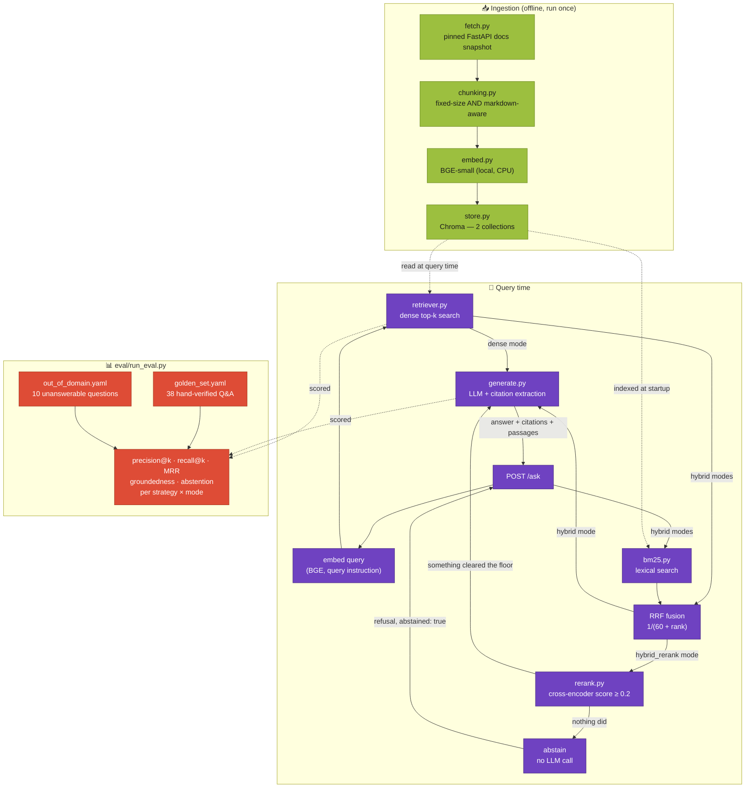

# DocQA-Agent

**A documentation Q&A assistant that shows its work: every claim cites a real passage, and every retrieval design decision is measured, not assumed.**

Ask a question about FastAPI and get an answer with inline citations to the exact
file and section it came from. The core of the repo is the evaluation harness
behind it: two chunking strategies × three retrieval modes (dense, hybrid
BM25 + RRF, hybrid + cross-encoder re-ranking), scored against 38 hand-verified
questions and 10 questions the corpus cannot answer.

[](https://github.com/Totm33606/doc-qa-agent/actions/workflows/ci.yml)
[](https://www.python.org/)
[](LICENSE)
[](https://docs.astral.sh/uv/)
[](https://huggingface.co/BAAI/bge-small-en-v1.5)
[](https://www.trychroma.com/)
[](#retrieval)
[](https://fastapi.tiangolo.com/)
[](https://docs.astral.sh/ruff/)
[](https://mypy-lang.org/)


*The interactive API docs FastAPI generates at `/docs` — see [Example](#example) for a real `/ask` exchange.*

---

## Table of contents

- [Why this project](#why-this-project)
- [Architecture](#architecture)
- [Repository structure](#repository-structure)
- [Quickstart](#quickstart)
- [Corpus](#corpus)
- [Ingestion & chunking](#ingestion--chunking)
- [Retrieval](#retrieval)
- [Generation & citations](#generation--citations)
- [Evaluation](#evaluation)
- [API](#api)
- [Testing & quality gates](#testing--quality-gates)
- [Technical choices](#technical-choices)
- [Out of scope](#out-of-scope)
- [License](#license)

---

## Why this project

Companion to [finrisk-agent](https://github.com/Totm33606/finrisk-agent), which
covers tool-calling agents and a classic ML pipeline; this one covers semantic
retrieval and grounded generation.

- **Real, pinned corpus.** The official FastAPI docs, fetched at a recorded
  release tag — which is what makes hand-checkable golden answers possible.
- **Design choices are measured.** Both chunking strategies and all three
  retrieval modes are first-class, and [Evaluation](#evaluation) scores every
  combination.
- **Citations are checked in code.** Each `[source: N]` marker is resolved
  against the passages actually retrieved; groundedness is computed, not
  self-reported by the model.
- **It can say "I don't know", and that is measured too.** A cross-encoder
  relevance floor, tuned against out-of-domain questions, lets the system refuse
  without calling the LLM.
- **No paid API key needed.** Embeddings and re-ranking run locally on CPU,
  Chroma is embedded, and generation defaults to a local Ollama model.

## Architecture



- **Ingestion is an offline batch job** (`ingestion.build`); query time only
  reads the built Chroma collections.
- **Each chunking strategy has its own collection** (`fastapi_docs_fixed`,
  `fastapi_docs_markdown`); `/ask` picks one per request and the eval scores both.
- **Retrieval mode is an eval dimension**: `dense`, `hybrid` and `hybrid_rerank`
  are all served, and `eval.run_eval` scores all six strategy × mode pairs.
- **Refusal is a retrieval decision made in code**: in `hybrid_rerank`, if no
  candidate clears the relevance floor, the answer is a fixed refusal and the LLM
  is never called.
- **Citations are verified mechanically**: `[source: N]` indices are resolved
  against the retrieved passages, not trusted.

## Repository structure

```
doc-qa-agent/
├── pyproject.toml              # dependencies and tool config (uv)
├── uv.lock                     # pinned dependency versions
├── Makefile                    # shortcuts: fetch / build / eval / api / test
├── .env.example                # LLM provider options + main DOCQA_ overrides
├── src/
│   ├── common/
│   │   ├── schemas.py          # shared data models
│   │   └── config.py           # typed, env-overridable settings
│   ├── ingestion/
│   │   ├── fetch.py            # pinned corpus fetch + Markdown cleanup
│   │   ├── chunking.py         # fixed-size and markdown-aware chunkers
│   │   ├── embed.py            # BGE-small wrapper (query vs. document embedding)
│   │   ├── store.py            # Chroma collection wrapper
│   │   └── build.py            # chunk → embed → store, both strategies
│   ├── retrieval/
│   │   ├── bm25.py             # lexical index over the same chunks
│   │   ├── rerank.py           # cross-encoder scoring
│   │   └── retriever.py        # dense / hybrid (RRF) / hybrid_rerank (+ relevance floor)
│   ├── generation/
│   │   ├── llm.py              # chat model selection (local-first)
│   │   ├── prompt.py           # system prompt + passage formatting
│   │   └── generate.py         # citation extraction, groundedness, abstention
│   └── api/app.py              # FastAPI app: POST /ask, GET /health
├── data/
│   ├── raw/                    # pinned corpus (committed)
│   └── chroma/                 # vector store (gitignored, rebuilt by ingestion.build)
├── eval/
│   ├── golden_set.yaml         # 38 hand-verified Q&A pairs
│   ├── out_of_domain.yaml      # 10 questions the corpus cannot answer
│   └── run_eval.py             # retrieval / groundedness / abstention metrics
├── tests/                      # hermetic pytest suite + 1 real-model integration file
├── docker/Dockerfile           # bakes corpus, vector store and models into the image
└── .github/workflows/ci.yml    # lint, format, typecheck, build store, test
```

## Quickstart

### Option A — uv (local dev)

```bash
git clone https://github.com/Totm33606/doc-qa-agent.git
cd doc-qa-agent
cp .env.example .env          # optional — defaults work with a local Ollama

uv sync --extra dev           # .venv with the exact versions pinned in uv.lock

# data/raw/ is committed; re-fetch only to target another FastAPI release:
#   uv run python -m ingestion.fetch

uv run python -m ingestion.build      # chunk + embed + store both strategies (~2 min on CPU)
uv run python -m eval.run_eval        # every strategy × mode: retrieval, groundedness, abstention

uv run uvicorn api.app:app --reload --port 8000
curl -X POST localhost:8000/ask -H "Content-Type: application/json" \
  -d '{"question": "How do I add validation to a query parameter?"}'
```

Generation defaults to a **local Ollama model**: have Ollama running with an
instruction-following model pulled (e.g. `ollama pull qwen2.5:7b-instruct`; tool
calling isn't needed). Without Ollama or a cloud key, `/ask` returns a 502 at the
generation step, but retrieval and `eval.run_eval --skip-generation` still work.
Azure OpenAI and OpenAI are configured through [.env.example](.env.example).

On Linux/macOS/WSL, the [Makefile](Makefile) provides shorter aliases
(`make build`, `make eval`, `make api`, `make test`); CI calls `uv` directly.

### Option B — Docker

```bash
docker build -f docker/Dockerfile -t doc-qa-agent .
docker run -p 8000:8000 \
  -e LOCAL_LLM_BASE_URL=http://host.docker.internal:11434/v1 \
  doc-qa-agent
```

The image builds both Chroma collections and downloads both models at build time,
so at runtime the container only needs network to reach the LLM.
`host.docker.internal` points to an Ollama running on the host; pass the
Azure/OpenAI variables from [.env.example](.env.example) to use a cloud model instead.

## Corpus

`ingestion/fetch.py` downloads **67 Markdown pages** — the core tutorial plus a
curated set of advanced-guide pages — from the docs *source* of the
`fastapi/fastapi` repository, at the pinned tag `0.141.1` (recorded in
`data/raw/manifest.json`).

- **Narrow scope** is what makes the 38 golden answers checkable by hand against a
  fixed text.
- **A pinned tag** keeps each question's `expected_sources` valid; tracking `main`
  would make the eval non-reproducible.
- **Excluded:** `reference/` (auto-generated signatures), `deployment/`, `about/`
  and meta pages (`alternatives.md`, `benchmarks.md`, …). See `TUTORIAL_PAGES` /
  `ADVANCED_PAGES` in [fetch.py](src/ingestion/fetch.py).

**Preprocessing** (in `fetch.py`):
- `{* path/to/file.py hl[6:7] *}` snippet macros are resolved by fetching the
  referenced file and inlining it as a fenced code block (honoring `ln[a:b]` ranges).
- `/// tip` and `/// note` admonitions become blockquotes.
- `<div class="termy">` terminal wrappers are stripped, keeping the code block inside.
- `{ #anchor-id }` suffixes are stripped from headings.

## Ingestion & chunking

| | **Fixed-size** (`fastapi_docs_fixed`) | **Markdown-aware** (`fastapi_docs_markdown`) |
|---|---|---|
| How it splits | `RecursiveCharacterTextSplitter` (paragraph → line → sentence → word → char), blind to structure | By Markdown header first, then the same recursive splitter on sections still over budget |
| Chunk size / overlap | ~500 / 50 tokens (`tiktoken`) | same |
| Citable unit | no section (`"(no section — fixed-size chunking)"`) | header breadcrumb, e.g. `"Path Parameters > Order matters"` |
| Chunks (this corpus) | **347** | **693** |
| Mean tokens/chunk | 428 | 205 |

The header splitter is hand-rolled (`chunking.py::_split_by_headers`, a fence-aware
line scanner that never rewrites a line). LangChain's `MarkdownHeaderTextSplitter`
strips every line, code blocks included, so `    return {"item_id": item_id}`
becomes `return {"item_id": item_id}` — breaking the Python examples that make up
most of this corpus.

## Retrieval

`retrieval/retriever.py` searches one strategy's collection in one of three modes:

| Mode | What it does |
|---|---|
| `dense` | Embed the question, cosine top-k against the collection |
| `hybrid` (default) | Dense search **plus** BM25 over the same chunks, combined by reciprocal rank fusion |
| `hybrid_rerank` | Hybrid candidates re-scored by a cross-encoder and dropped below a relevance floor — the only mode that can decline to answer |

### Query embedding

As recommended by the `BAAI/bge-small-en-v1.5` model card, queries — never stored
passages — are prefixed with `"Represent this sentence for searching relevant
passages: "` (`embed_query` vs `embed_documents` in `embed.py`). This asymmetry is
why `store.py` passes precomputed embeddings to Chroma instead of registering a
single embedding function.

### Hybrid search: BM25 + RRF

Embeddings generalize ("validate input" finds passages that never say "validate")
but blur the exact identifiers a docs corpus is searched by —
`response_model_exclude_unset`, `BackgroundTasks`. BM25 scores literal terms
weighted by rarity, so the two tend to fail on different questions.

**Fusion is on rank, not score**: cosine similarity and BM25 scores live on
unrelated scales, so combining them would require a tuned normalization and weight.
RRF keeps only each retriever's ranking:

```
score(d) = Σ  1 / (60 + rank_r(d))
           r
```

`60` (`config.rrf_k`) is the constant from Cormack et al. (2009), **kept rather than
tuned** — tuning it on the 38 golden questions would just fit the eval set. With it,
ranking second in both lists (2/62) beats ranking first in only one (1/61).

- **Each side contributes 20 candidates** (`config.hybrid_candidates`), not `top_k`,
  so BM25 can surface passages the dense search missed entirely. The fused list is
  then truncated to `top_k`.
- **The BM25 index is built in memory from Chroma** (`ChunkStore.get_all()`) when a
  hybrid retriever is constructed — no second artifact to persist or keep in sync.
- **Tokenization is plain**: lowercase, no stemming, no stop words; `[a-z0-9_]+`
  keeps `response_model_exclude_unset` as one token.

### Cross-encoder re-ranking and the relevance floor

RRF can say which candidate is best, never whether the best is any good: an
off-topic question still gets a confidently ordered top 5. `hybrid_rerank` re-scores
the fused candidates with `cross-encoder/ms-marco-MiniLM-L-6-v2`, which reads
question and passage together — more accurate than comparing two independent
vectors, but too slow for the whole corpus, hence its place after cheap retrieval.

The checkpoint outputs unbounded logits (−11.4 to +8.6 on this corpus);
`rerank.py` applies a sigmoid so scores land in [0, 1]. The ranking is unchanged,
but a threshold now means the same thing **from one question to the next** — which
holds for neither cosine nor RRF scores (a passage ranked first by both retrievers
scores 2/61 whether or not it answers anything).

Candidates below `config.rerank_min_score` (**0.2**, chosen in
[Evaluation](#evaluation)) are dropped; when none clears it, retrieval returns
nothing and `generate.py` returns a fixed refusal **without calling the LLM**.
`dense` and `hybrid` deliberately have no floor: a threshold on their scores would
have no defensible origin.

## Generation & citations

`generation/prompt.py` shows the LLM numbered passages (`[1] tutorial/path-params.md#Path Parameters > Order matters`,
then the text) and asks for a `[source: N]` citation after every claim. Citing
**by index** is a deliberate revision: an earlier version asked the model to copy
the `file#section` string, which the local 7B model regularly mangled (dropped
segments, `>` swapped for `#`), zeroing groundedness for correctly sourced answers.
`generate.py::extract_citations` resolves each index back to its passage.

**Scoring rules** (`generate.py`):
- Accepted forms: `[source: N]` (requested), bare `[N]` (the model sometimes echoes
  the context notation), and `[source: 2,5]` — grounded only if every index is valid.
- A citation counts only when it **trails** the claim it supports; a leading
  citation grades nothing. Carrying leading citations forward was tried and dropped:
  the score stopped reflecting whether the requested format was followed.
- Groundedness is a syntactic proxy: it catches citations to passages never shown,
  not claims the cited passage doesn't support.

**Refusing to answer.** The system prompt asks the model to say when the passages
are insufficient, but nothing enforces that. When retrieval comes back empty (in
`hybrid_rerank`: nothing cleared the floor), `generate_answer` returns a fixed
refusal with `abstained: true` and no LLM call.

**LLM selection** (`generation/llm.py`): Azure OpenAI if its key and endpoint are
set, otherwise a local OpenAI-compatible server (Ollama by default), otherwise
OpenAI. Because the local server is the default, running the demo costs nothing.

## Evaluation

[eval/golden_set.yaml](eval/golden_set.yaml) holds 38 questions written by hand
against the fetched corpus; every `expected_sources` entry is a real file in
`data/raw/`. [eval/out_of_domain.yaml](eval/out_of_domain.yaml) holds 10 questions
the corpus cannot answer, where the only correct response is a refusal.
`eval/run_eval.py` scores all six strategy × mode configurations with the same code.

Numbers from a from-scratch `uv run python -m eval.run_eval --sweep` (38 + 10 questions,
k=5, `qwen2.5:7b-instruct` via Ollama 0.34 for generation; ~3 h on an RTX 2070 Super),
rounded to four decimals:

| Configuration | Precision@5 | Recall@5 | MRR | Mean groundedness |
|---|---|---|---|---|
| fixed / dense | 0.5579 | 0.9737 | **0.9079** | **1.0000** |
| fixed / hybrid | 0.5526 | 0.9737 | 0.9053 | **1.0000** |
| fixed / hybrid_rerank | 0.4632 | 0.9211 | 0.7895 | 0.9868 |
| markdown / dense | 0.5789 | 0.9342 | 0.8662 | **1.0000** |
| **markdown / hybrid** ← default | **0.5895** | **1.0000** | 0.9035 | **1.0000** |
| markdown / hybrid_rerank | 0.5632 | 0.9605 | 0.8487 | 0.9912 |

**Hybrid search is a pairing, not a free upgrade.** With markdown-aware chunking it
lifts recall from 0.9342 to **1.0000** (the expected file is in the top 5 for all
38 questions) and MRR from 0.8662 to 0.9035. With fixed-size chunking it slightly
hurts (precision 0.5579 → 0.5526, MRR 0.9079 → 0.9053, recall unchanged): 428-token
chunks dilute term frequency and BM25's length normalization penalizes them, so the
lexical ranking adds noise.

**Groundedness doesn't separate the configurations.** Four score 1.0000 and the two
re-ranked ones 0.9868 and 0.9912, about one answer's worth each over 38. The metric
checks citation format and validity, which the 7B model gets right whatever it's given.
At `temperature=0` it is reproducible in a fixed environment (two consecutive full runs
have produced byte-identical reports), yet `fixed`/`dense` has read 0.9803, 0.9868 and
1.0000 across environment and corpus changes — so don't read a one-question difference
as a result.

**Re-ranking makes retrieval worse on this corpus, and buys the ability to refuse.**
Compared with `hybrid`, markdown drops precision 0.5895 → 0.5632, recall
1.0000 → 0.9605 and MRR 0.9035 → 0.8487; fixed drops MRR 0.9053 → 0.7895.
Disabling the floor (`min_rerank_score=0.0`) separates the two causes:

| Effect (markdown) | Precision@5 | Recall@5 | MRR |
|---|---|---|---|
| `hybrid` — fusion only | 0.5895 | 1.0000 | 0.9035 |
| + cross-encoder re-ordering (floor off) | 0.5789 | 0.9605 | 0.8487 |
| + relevance floor at 0.2 | 0.5632 | 0.9605 | 0.8487 |

- **Re-ordering causes all of the MRR loss and most of the recall loss.** The
  cross-encoder, trained on MS MARCO web passages, is judging API prose full of code
  and identifiers — a domain shift a 22M-parameter model absorbs poorly. A
  FastAPI-tuned re-ranker might well reverse the result.
- **The floor costs precision, not refusals.** No golden question is refused
  (false abstention 0.0000 everywhere); instead, relevant passages scoring below 0.2
  are dropped from answers that still get produced, and precision@5 always divides
  by 5. On the fixed collection it also cost recall (0.9342 → 0.9211): one question's
  only chunk from its expected file scored below the floor.

**Why `markdown` + `hybrid` is the default.** It is the only configuration
best-or-tied on three of the four metrics, and the only one with perfect recall.
Neither added stage is universally worth it: fusion helps one chunking strategy and
slightly hurts the other; re-ranking hurts both but is the only way to decline to
answer — so it ships as an opt-in mode.

**Precision@5 has a structural ceiling, and still real headroom.** 34 of 38 questions
expect a single file, and precision@k always divides by k=5, so a question scores 1.0
only if five chunks of its expected file(s) land in the top 5. That ceiling
(`min(5, chunks in the expected file(s)) / 5`, averaged) is **0.868** (fixed) and
**0.989** (markdown); the observed 0.463–0.589 is well below it. Recall@5 and MRR
remain the more informative columns for this mostly single-source golden set.

### Knowing what it doesn't know

| Configuration | Relevance floor | False abstention (38 in-domain) | Correct abstention (10 out-of-domain) |
|---|---|---|---|
| `dense` / `hybrid`, both strategies | none | 0.0000 | 0.0000 |
| fixed / hybrid_rerank | 0.2 | **0.0000** | **0.6000** |
| markdown / hybrid_rerank | 0.2 | **0.0000** | **0.6000** |

`dense` and `hybrid` report `threshold: null`: their 0.0000 means they *cannot*
abstain, not that they chose to answer.

**Choosing the threshold.** `--sweep` records each question's best re-rank score
(the only one the floor's decision depends on) and evaluates the whole grid from a
single retrieval pass:

| Threshold | False abstention | Correct abstention | |
|---|---|---|---|
| 0.001 | 0.0000 | 0.4000 | |
| 0.005 | 0.0000 | 0.5000 | |
| 0.02 | 0.0000 | 0.6000 | |
| **0.2** | **0.0000** | **0.6000** | ← chosen |
| 0.3 | 0.0263 | 0.6000 | first false abstention |
| 0.5 | 0.0263 | 0.7000 | |

(Markdown collection; the fixed one is within one question everywhere — full grid
for both in `eval_report.json`. Lowest in-domain / highest out-of-domain best scores:
0.2514 / 0.9722 for markdown, 0.2517 / 0.9926 for fixed.)

Every threshold from 0.02 to 0.2 gives the same 0.0000 / 0.6000. **0.2 is the upper
end of that plateau**: it refuses unseen off-topic questions scoring anywhere below
it, while staying ~20% under the lowest in-domain score (0.2514). 0.3 starts refusing
real questions; 0.5 trades a false abstention for one more catch — the wrong trade
for a documentation assistant.

**Both rates are in-sample.** The sweep that picked 0.2 used both question sets, so
0.0000 and 0.6000 are optimistic estimates — the same objection that keeps `rrf_k`
untuned. The plateau at least means the choice isn't balanced on a knife-edge.

**The four misses are the interesting ones.** Best re-rank score per out-of-domain
question (markdown collection):

| Out-of-domain question | Top re-rank score | Verdict at floor 0.2 |
|---|---|---|
| "Django middleware that adds a response header" | **0.9722** | answered — from `tutorial/middleware.md` |
| "What changed in FastAPI 0.200?" | 0.7609 | answered — from `tutorial/body-nested-models.md` |
| "Flask blueprint, register it on the app" | 0.6789 | answered — from `tutorial/bigger-applications.md` |
| "Create a PostgreSQL index for a slow query" | 0.3917 | answered — from `advanced/advanced-dependencies.md` |
| "DRF serializer to validate incoming data" | 0.0155 | refused |
| "Spring Boot REST controller in Java" | 0.0017 | refused |
| "Train a random forest with scikit-learn" | 0.0001 | refused |
| "Docker image vs. container" | 0.0000 | refused |
| "Capital of Australia" | 0.0000 | refused |
| "Limerick about a cat" | 0.0000 | refused |

Everything the gate catches scores near zero; the four it misses genuinely resemble
FastAPI questions. A cross-encoder scores **relevance, not answerability**:
`tutorial/middleware.md` really is the most relevant page for a Django middleware
question — it's just about the wrong framework. Catching that needs a model that
tells "on topic" from "answers this", which no threshold on a relevance score
provides.

### How the metrics are computed

- **precision@k / recall@k / MRR** (`run_eval.py::evaluate_question`, aggregated by
  `retrieval_metrics`), at **file** level, since the two strategies don't share chunk
  boundaries. Precision = retrieved passages from an expected file ÷ k; recall =
  expected files found ÷ expected files; MRR = 1/rank of the first passage from an
  expected file.
- **groundedness** (`generate.py::compute_groundedness`): fraction of claim segments
  followed by a valid citation (see [Generation & citations](#generation--citations)).
- **false / correct abstention rate** (`run_eval.py::abstention_metrics`): a question
  counts as refused when retrieval returns nothing; retrieval-only, so available with
  `--skip-generation`.
- **Abstentions are excluded from mean groundedness**: a refusal has no citations and
  would score 0.0, making a correct refusal look like a hallucination.
  `abstention_rate` is reported alongside.

```bash
uv run python -m eval.run_eval                    # retrieval + generation
uv run python -m eval.run_eval --skip-generation  # retrieval + abstention only, no LLM needed
uv run python -m eval.run_eval --sweep            # + the relevance-floor grid
```

**Trusting the scoring code.** The scoring functions are unit-tested against
hand-computed cases (e.g. precision@3 = 1/3, recall@3 = 1/2, MRR = 1/2 in
`tests/test_eval.py`). Reading real generated answers surfaced two scoring bugs: a
stray uncited `"."` in `"claim [3]."`, and unrecognized bare `[N]` citations. Every
run also writes `eval/eval_details.md` (gitignored, like `eval_report.json`): one
entry per question × strategy × mode with expected and retrieved sources, the
generated answer and its scores.

**Trusting the golden set.** The `expected_sources` were assigned by hand while
reading the corpus — one person's reading. A phrase-matching script flagged 4 of 38
questions, all false positives on manual review, but the same author wrote both, so
that check isn't independent. A more independent signal: markdown/hybrid retrieves
every expected file in its top 5, and no expected file is missed by all six
configurations.

## API

```bash
uv run uvicorn api.app:app --reload --port 8000
```

| Endpoint | Purpose |
|---|---|
| `POST /ask` | `{"question": str, "top_k": int = 5, "strategy": "fixed" \| "markdown" = "markdown", "mode": "dense" \| "hybrid" \| "hybrid_rerank" = "hybrid"}` → `{question, answer, citations, passages, groundedness_score, abstained}` |
| `GET /health` | Liveness check |

An abstention is a normal `200`: `abstained: true`, empty `passages` and a refusal
in `answer`. Only `hybrid_rerank` produces one. There is no frontend.

### Example

A real response (`qwen2.5:7b-instruct` via Ollama; defaults `strategy=markdown`,
`mode=hybrid`, `top_k=5`). `passages` is trimmed to the first and last of the five,
with texts truncated:

```bash
curl -X POST localhost:8000/ask -H "Content-Type: application/json" \
  -d '{"question": "Why does the order of path operations matter in FastAPI?"}'
```

```json
{
  "question": "Why does the order of path operations matter in FastAPI?",
  "answer": "The order of path operations matters in FastAPI because paths are evaluated in the order they are defined. If the path for `/users/me` is defined after the path for `/users/{user_id}`, the path for `/users/me` would not be matched correctly, as it would be interpreted as a parameter. [source: 1]",
  "citations": [
    {
      "source_file": "tutorial/path-params.md",
      "section": "Path Parameters > Order matters",
      "matched_passage": true
    }
  ],
  "passages": [
    {
      "chunk_id": "markdown:tutorial/path-params.md:7",
      "text": "## Order matters\n\nWhen creating *path operations*, you can find situations where you have a fixed path...",
      "source_file": "tutorial/path-params.md",
      "section": "Path Parameters > Order matters",
      "score": 0.03252247488101534,
      "rerank_score": null
    },
    {
      "chunk_id": "markdown:tutorial/path-params-numeric-validations.md:3",
      "text": "## Order the parameters as you need\n\n> **TIP:**\n> This is probably not as important or necessary if you use `Annotated`...",
      "source_file": "tutorial/path-params-numeric-validations.md",
      "section": "Path Parameters and Numeric Validations > Order the parameters as you need",
      "score": 0.01639344262295082,
      "rerank_score": null
    }
  ],
  "groundedness_score": 1.0,
  "abstained": false
}
```

**Reading the scores.** In the hybrid modes `score` is the RRF value, so the fusion
can be read off it: `0.032522` = `1/61 + 1/62` (first in one ranking, second in the
other); `0.016393` = `1/61` (first in one ranking, absent from the other — a passage
the other retriever alone would have missed). In `dense` mode the field is a cosine
similarity. In `hybrid_rerank`, passages keep the RRF `score`, gain a `rerank_score`,
and are ordered by the latter.

The same endpoint in `hybrid_rerank` mode, on a question the corpus doesn't cover:

```bash
curl -X POST localhost:8000/ask -H "Content-Type: application/json" \
  -d '{"question": "How do I train a random forest in scikit-learn?", "mode": "hybrid_rerank"}'
```

```json
{
  "question": "How do I train a random forest in scikit-learn?",
  "answer": "I couldn't find anything in the FastAPI documentation relevant to this question, so I won't try to answer it.",
  "citations": [],
  "passages": [],
  "groundedness_score": 0.0,
  "abstained": true
}
```

No LLM produced that: the best candidate scored 0.00004 against the 0.2 floor. In
`hybrid` mode the same question returns five irrelevant passages (led by
`tutorial/query-params-str-validations.md` and `tutorial/path-params.md`), and here
the model happens to refuse correctly:

> The provided passages do not contain information on how to train a random forest
> in scikit-learn. The passages are related to FastAPI and do not cover machine
> learning topics. [source: 1][source: 2][source: 3][source: 4][source: 5]

That refusal even scores groundedness 1.0, since it cites all five passages — a
reminder that the metric checks citation form, not substance. It is rule 2 of the
system prompt working, as it often does. The floor turns it
into a guarantee — no LLM call, no irrelevant passages returned — instead of
something the model may or may not do on a given question.

## Testing & quality gates

```bash
uv run pytest                        # 167 tests
uv run pytest -m "not integration"   # skip the real-model tests
uv run ruff check src tests eval
uv run ruff format --check src tests eval
uv run mypy src tests eval
```

- **Hermetic by default.** `tests/conftest.py` provides `FakeEmbedder` (hash-based),
  `FakeReranker` (scores dictated per chunk id, so relevance is a test premise) and
  `FakeChatModel` (canned answer): no network, Ollama or API key. `test_fetch_network.py`
  exercises the HTTP code through `httpx.MockTransport`, without real requests.
- **One integration file.** `tests/test_integration.py` (marker `integration`) loads
  the real embedder and cross-encoder (downloaded on first run) and checks only what
  the code relies on: re-rank scores in [0, 1] and topical ranking. One test also
  queries the built `data/chroma` store and is skipped if it doesn't exist.
- **Coverage: 99%** of `src/` and `eval/`; the 6 uncovered statements are the
  `main()` / `__main__` entry points of the three CLIs.
- **CI** ([ci.yml](.github/workflows/ci.yml)), on pushes and pull requests to `main`:
  lint, format check, mypy, vector store build, then the full suite with coverage.

## Technical choices

| Layer | Choice | Why |
|---|---|---|
| Embeddings | `BAAI/bge-small-en-v1.5` (`sentence-transformers`, CPU) | Strong small retrieval model (384-dim, ~130MB); no API key or GPU. |
| Lexical search | `rank-bm25` (`BM25Okapi`), in memory | Standard implementation; indexed from Chroma, so ingestion remains the only writer. |
| Rank fusion | RRF, `k=60`, hand-rolled (~10 lines) | Ranks are comparable where scores aren't; small enough to own and unit-test against hand-computed values. |
| Re-ranking | `cross-encoder/ms-marco-MiniLM-L-6-v2` | Small (~22M params, ~90MB) and no new dependency; larger re-rankers (`bge-reranker-base`, ~1.1GB) break the CPU-friendly bar. |
| Vector store | Chroma, embedded | No server; `PersistentClient` for the corpus, `EphemeralClient` for most tests. |
| Chunking (fixed) | `RecursiveCharacterTextSplitter`, sized with `tiktoken` | The standard baseline; token sizing makes "~500 tokens" literal. |
| Chunking (markdown) | Hand-rolled fence-aware header splitter | LangChain's header splitter destroys code indentation (see [Ingestion & chunking](#ingestion--chunking)). |
| Generation LLM | Azure OpenAI → local server (Ollama, default) → OpenAI | Azure wins when configured; otherwise the local default keeps the demo free. |
| Citation format | Passage index `[source: N]` | A small local model copies a digit reliably, not a long `file#section` string. |
| Corpus fetch | GitHub raw Markdown source at a pinned tag | Cleaner than scraped HTML; the pin keeps `expected_sources` valid. |
| Configuration | pydantic-settings (`common/config.py`) | One typed settings object shared by every stage. |
| API | FastAPI | The framework the corpus documents; models and retrievers are built once in `lifespan`. |
| Packaging | uv | One fast tool for environments, installs and scripts on every OS. |

**Design notes**
- **Corpus committed, vector store not.** `data/raw/` (~752KB of Markdown) makes the
  eval reproducible offline; `data/chroma/` (~16MB) is derived and gitignored.
- **One pipeline scores every configuration.** `run_all` loops over
  `ChunkingStrategy` × `RetrievalMode` and calls `evaluate_question` identically, so
  adding `hybrid_rerank` required no scoring change.
- **Modes are fixed per `Retriever`.** A `dense` retriever builds no BM25 index and
  only `hybrid_rerank` uses the cross-encoder; the API builds all six retrievers at
  startup, sharing one embedder and one re-ranker.

## Out of scope

No frontend, query rewriting, authentication or deployment infrastructure. Hybrid
search and re-ranking both started on this list and left it the same way: built,
measured, then placed according to the numbers — hybrid as the default, re-ranking
as an opt-in mode.

## License

MIT — see [LICENSE](LICENSE).
